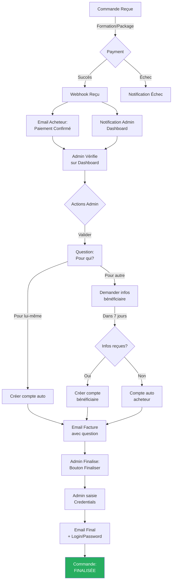

# 🔄 ANALYSE DU WORKFLOW COMMANDES LMS

## Projet : Agrégateur de Paiement - Cycle de Vie des Inscriptions

---

## 1. COMPRÉHENSION DU WORKFLOW

### Diagramme de Flux Représenté


   
---

## 2. ANALYSE CRITIQUE - POINT DE VUE SENIOR

### 2.1 Forces du Workflow

| Aspect                            | Évaluation     | Commentaire                                            |
| --------------------------------- | -------------- | ------------------------------------------------------ |
| **Séparation des préoccupations** | ✅ Excellent   | Phase paiement ≠ Phase validation ≠ Phase finalisation |
| **Contrôle humain**               | ✅ Excellent   | Validation admin avant accès formation                 |
| **Capture données thérapeut**     | ✅ Intelligent | Question "pour qui" très importante pour LMS           |
| **Timeout automatisé**            | ✅ Bon         | 7 jours pour réponse, sinon compte auto                |

### 2.2 Points d'Attention & Risques

| #   | Risque                                 | Sévérité    | Recommandation                                                |
| --- | -------------------------------------- | ----------- | ------------------------------------------------------------- |
| 1   | **Saisie credentials admin**           | 🔴 Critique | Password visible en clair pendant saisie → Hash immediatement |
| 2   | **Récupération credentials**           | 🔴 Critique | Si admin fermet avant envoi = données perdues                 |
| 3   | **Pas de traçabilité création compte** | 🟡 Moyen    | Logguer QUI a créé le compte campus                           |
| 4   | **Email credentials**                  | 🔴 Critique | **NE JAMAIS** envoyer password en clair par email             |
| 5   | **7 jours hardcodé**                   | 🟡 Moyen    | Faire configurable dans Settings                              |
| 6   | **Double création compte**             | 🟡 Moyen    | Risque de doublon si re-validation                            |
| 7   | **État "en attente"**                  | 🟡 Moyen    | Pas de deadlock si admin ne valide jamais                     |

---

## 3. PROBLÉMATIQUES SÉCURITAIRES CRITIQUES

### 3.1 Problème #1 : Saisie des Credentials par l'Admin

**Situation actuelle :**

> L'admin doit entrer username + password, ces données seront envoyées avec le mail final

**Risques :**

1. L'admin voit le mot de passe en clair sur son écran
2. Si la session expire ou erreur → données perdues
3. Stockage temporaire en mémoire non sécurisé
4. Transmission email en clair (violation RGPD + PCI-DSS)

**Solution Architecturale :**

```javascript
// APPROCHE SÉCURISÉE RECOMMANDÉE

// 1. Génération automatique du password temporaire
const generateTempPassword = () => {
  return crypto.randomBytes(16).toString("hex"); // 32 chars
};

// 2. Hash immédiat du password AVANT tout stockage
const hashedPassword = await bcrypt.hash(tempPassword, 12);

// 3. Envoi EMAIL SÉCURISÉ avec lien de reset
// Jamais le password en clair !
await MailService.sendCredentialsEmail({
  to: userEmail,
  login: username,
  resetLink: `https://campus.studieslearning.com/reset?token=${resetToken}`,
  expiresIn: "24 heures",
});
```

### 3.2 Problème #2 : Flux "Pour une autre personne"

**Situation actuelle :**

> Si c'est pour une autre personne → besoin d'info pour créer compte manuellement sur le campus

**Amélioration recommandée :**

```mermaid
flowchart LR
    A[Admin Valide] --> B{Pour qui?}
    B -->|Lui-même| C[Compte AUTO via API<br/>LMS]
    B -->|Autre personne| D[Formulaire Admin:<br/>Nom, Email, Phone]
    D --> E[Email au BENEFICIAIRE:<br/>"Quelqu'un a acheté pour vous"]
    E --> F[Le beneficiaire<br/>choisit son password]
    F --> G[Compte CRÉÉ]

    C --> H[Email avec<br/>Reset Link]
    G --> H
```

**Nouveaux champs nécessaires :**

- `beneficiaryFirstName` (string)
- `beneficiaryLastName` (string)
- `beneficiaryEmail` (string)
- `beneficiaryPhone` (string, optional)
- `relationship` (string: "famille", "ami", "collegue", etc.)

---

## 4. PROPOSITION : NOUVEAU SYSTÈME D'ÉTAT

### 4.1 Machine à États Recommandée

```javascript
const OrderStatus = {
  // Phase 1: Paiement
  PENDING_PAYMENT: "pending_payment", // En attente paiement
  PAYMENT_RECEIVED: "payment_received", // Paiement reçu (webhook)

  // Phase 2: Vérification
  AWAITING_VERIFICATION: "awaiting_verification", // En attente validation admin
  VERIFIED: "verified", // Admin a vérifié et validé

  // Phase 3: Question destinataire
  AWAITING_BENEFICIARY_INFO: "awaiting_beneficiary_info", // En attente info tiers
  BENEFICIARY_INFO_RECEIVED: "beneficiary_info_received", // Info reçues

  // Phase 4: Account creation
  ACCOUNT_CREATING: "account_creating", // En cours de création
  ACCOUNT_CREATED: "account_created", // Compte créé sur LMS

  // Phase 5: Finalisation
  AWAITING_FINALIZATION: "awaiting_finalization", // En attente finalisation
  FINALIZED: "finalized", // Terminé - accès délivré

  // États d'erreur
  PAYMENT_FAILED: "payment_failed",
  VERIFICATION_REJECTED: "verification_rejected",
  EXPIRED: "expired", // Timeout (7 jours)
  CANCELLED: "cancelled",
};
```

### 4.2 Transitions d'État

| De                          | Action              | Vers                                              | Trigger                            |
| --------------------------- | ------------------- | ------------------------------------------------- | ---------------------------------- |
| `PENDING_PAYMENT`           | Paiement OK         | `PAYMENT_RECEIVED`                                | Webhook success                    |
| `PAYMENT_RECEIVED`          | Admin ouvre         | `AWAITING_VERIFICATION`                           | GET /admin/orders/:id              |
| `AWAITING_VERIFICATION`     | Admin valide        | `VERIFIED` ou `VERIFICATION_REJECTED`             | POST /admin/orders/:id/verify      |
| `VERIFIED`                  | Question répondue   | `AWAITING_BENEFICIARY_INFO` ou `ACCOUNT_CREATING` | POST /admin/orders/:id/beneficiary |
| `AWAITING_BENEFICIARY_INFO` | Timeout 7j          | `EXPIRED`                                         | Cron job daily                     |
| `AWAITING_BENEFICIARY_INFO` | Info reçue          | `ACCOUNT_CREATING`                                | POST /admin/orders/:beneficiary    |
| `ACCOUNT_CREATING`          | API LMS             | `ACCOUNT_CREATED`                                 | Webhook LMS                        |
| `ACCOUNT_CREATED`           | Admin finalise      | `AWAITING_FINALIZATION`                           | POST /admin/orders/:id/finalize    |
| `AWAITING_FINALIZATION`     | Credentials saisies | `FINALIZED`                                       | POST /admin/orders/:id/complete    |

---

## 5. MODÈLE DE DONNÉES PROPOSÉ

### 5.1 Extension du Modèle Order

```javascript
// Nouveau modèle: OrderLifecycle
OrderLifecycle.init(
  {
    orderId: {
      type: DataTypes.BIGINT.UNSIGNED,
      references: { model: "orders", key: "id" },
    },
    status: {
      type: DataTypes.ENUM(Object.values(OrderStatus)),
      defaultValue: OrderStatus.PENDING_PAYMENT,
    },

    // Phase paiement
    paymentReceivedAt: DataTypes.DATE,
    paymentIntentId: DataTypes.STRING,
    aggregatorRef: DataTypes.STRING,

    // Phase vérification
    verifiedAt: DataTypes.DATE,
    verifiedBy: DataTypes.BIGINT.UNSIGNED, // Admin ID
    verificationNotes: DataTypes.TEXT,

    // Phase beneficiary
    isForBeneficiary: DataTypes.BOOLEAN,
    beneficiaryFirstName: DataTypes.STRING,
    beneficiaryLastName: DataTypes.STRING,
    beneficiaryEmail: DataTypes.STRING,
    beneficiaryPhone: DataTypes.STRING,
    beneficiaryRelationship: DataTypes.STRING,
    beneficiaryInfoRequestedAt: DataTypes.DATE,
    beneficiaryInfoReceivedAt: DataTypes.DATE,

    // Phase account creation
    lmsUserId: DataTypes.BIGINT.UNSIGNED,
    lmsAccountCreatedAt: DataTypes.DATE,
    lmsAccountCreatedBy: DataTypes.BIGINT.UNSIGNED,

    // Phase finalisation
    credentialsSentAt: DataTypes.DATE,
    credentialsSentTo: DataTypes.STRING,
    finalizedAt: DataTypes.DATE,
    finalizedBy: DataTypes.BIGINT.UNSIGNED,

    // Metadata
    expiresAt: DataTypes.DATE, // Pour timeout 7 jours
    metadata: DataTypes.JSON,
  },
  {
    timestamps: true,
    updatedAt: false, // Immuable
  },
);
```

---

## 6. WORKFLOW DÉTAILLÉ AVEC SÉCURITÉ

### 6.1 Étape 1: Paiement Reçu (Webhook)

```javascript
async function handlePaymentSuccess(webhookData) {
  const order = await Order.findById(webhookData.orderId);

  // Créer lifecycle
  const lifecycle = await OrderLifecycle.create({
    orderId: order.id,
    status: OrderStatus.PAYMENT_RECEIVED,
    paymentReceivedAt: new Date(),
    paymentIntentId: webhookData.intentId,
    aggregatorRef: webhookData.transactionRef,
    expiresAt: new Date(Date.now() + 7 * 24 * 60 * 60 * 1000), // 7 jours
  });

  // 1. Email acheteur (succès)
  await MailService.sendPaymentConfirmation(order, {
    includeInvoiceNote: true, // "Facture après vérification"
    showNextStep: "L'équipe va vérifier votre paiement",
  });

  // 2. Notification dashboard admin
  await NotificationService.create({
    type: "PAYMENT_RECEIVED",
    title: "Nouveau paiement à vérifier",
    orderId: order.id,
    priority: "high",
  });

  // 3. Audit log
  await AuditLog.log("PAYMENT_RECEIVED", "order", order.id, {
    amount: order.amount,
    customer: order.customerEmail,
  });
}
```

### 6.2 Étape 2: Vérification Admin

```javascript
async function verifyOrder(orderId, adminId, action, notes) {
  const lifecycle = await OrderLifecycle.findOne({ where: { orderId } });

  if (action === "approve") {
    await lifecycle.update({
      status: OrderStatus.VERIFIED,
      verifiedAt: new Date(),
      verifiedBy: adminId,
      verificationNotes: notes,
    });

    // Trigger: Question beneficiary
    await triggerBeneficiaryQuestion(orderId);
  } else if (action === "reject") {
    await lifecycle.update({
      status: OrderStatus.VERIFICATION_REJECTED,
      verifiedAt: new Date(),
      verifiedBy: adminId,
      verificationNotes: notes,
    });

    // Notifier acheteur
    await MailService.sendPaymentRejected(order, notes);
  }

  // Audit
  await AuditLog.log(
    action === "approve" ? "ORDER_VERIFIED" : "ORDER_REJECTED",
    "order",
    orderId,
    { adminId, notes },
  );
}
```

### 6.3 Étape 3: Question Bénéficiaire

```javascript
async function triggerBeneficiaryQuestion(orderId) {
  const order = await Order.findById(orderId);

  // Envoyer email avec question interactive
  await MailService.sendInvoiceWithQuestion(order, {
    question: "Cette formation est-elle pour vous ou pour quelqu'un d'autre?",
    options: [
      { label: "Pour moi", action: "/orders/{id}/beneficiary?self=true" },
      {
        label: "Pour quelqu'un d'autre",
        action: "/orders/{id}/beneficiary?self=false",
      },
    ],
    deadline: "7 jours",
  });

  await lifecycle.update({
    status: OrderStatus.AWAITING_BENEFICIARY_INFO,
  });
}
```

### 6.4 Étape 4: Création Compte LMS (SÉCURISÉE)

```javascript
async function createLmsAccount(orderId, beneficiaryData, createdByAdminId) {
  // 1. Générer password temporaire SECURE
  const tempPassword = crypto.randomBytes(16).toString("hex");
  const hashedPassword = await bcrypt.hash(tempPassword, 12);

  // 2. Créer utilisateur LMS via API
  const lmsUserId = await LmsBridgeService.createUser({
    email: beneficiaryData.email,
    firstName: beneficiaryData.firstName,
    lastName: beneficiaryData.lastName,
    passwordHash: hashedPassword, // JAMAIS le plain password
    role: "student",
    metadata: {
      orderId: orderId,
      purchaseType: beneficiaryData.isSelf ? "self" : "gift",
    },
  });

  // 3. Update lifecycle
  await lifecycle.update({
    status: OrderStatus.ACCOUNT_CREATED,
    lmsUserId: lmsUserId,
    lmsAccountCreatedAt: new Date(),
    lmsAccountCreatedBy: createdByAdminId,
  });

  // 4. Envoyer email avec RESET LINK (jamais le password!)
  await MailService.sendAccountCreatedNotification({
    email: beneficiaryData.email,
    login: beneficiaryData.email,
    resetPasswordLink: `https://campus.studieslearning.com/reset?user=${lmsUserId}&token=${generateResetToken(lmsUserId)}`,
  });

  // 5. Audit
  await AuditLog.log("LMS_ACCOUNT_CREATED", "order", orderId, {
    lmsUserId,
    createdBy: createdByAdminId,
    method: beneficiaryData.isSelf ? "auto" : "manual",
  });
}
```

### 6.5 Étape 5: Finalisation (CRITICAL SECURITY)

```javascript
async function finalizeOrder(orderId, adminId, credentials) {
  const lifecycle = await OrderLifecycle.findOne({ where: { orderId } });

  // 1. Validations de sécurité
  if (lifecycle.status !== OrderStatus.ACCOUNT_CREATED) {
    throw new Error("Order must be in ACCOUNT_CREATED status");
  }

  if (!credentials.username || !credentials.password) {
    throw new Error("Credentials required");
  }

  // 2. HASH IMMÉDIAT du password - NE JAMAIS LE STOCKER EN CLAIR
  const hashedPassword = await bcrypt.hash(credentials.password, 12);

  // 3. Update LMS avec credentials finaux
  await LmsBridgeService.updateUserCredentials(lifecycle.lmsUserId, {
    username: credentials.username,
    passwordHash: hashedPassword,
  });

  // 4. Envoyer email FINAL avec lien de connexion
  // JAMAIS de password en clair!
  await MailService.sendFinalWelcomeEmail({
    to: lifecycle.beneficiaryEmail,
    username: credentials.username,
    loginLink: "https://campus.studieslearning.com/login",
    orderReference: order.reference,
    invoiceAttached: true,
  });

  // 5. Update lifecycle
  await lifecycle.update({
    status: OrderStatus.FINALIZED,
    finalizedAt: new Date(),
    finalizedBy: adminId,
    credentialsSentAt: new Date(),
    credentialsSentTo: lifecycle.beneficiaryEmail,
  });

  // 6. Audit - NOTER que credentials ont été envoyés mais PAS le password!
  await AuditLog.log("ORDER_FINALIZED", "order", orderId, {
    adminId,
    credentialsSent: true,
    method: "admin_manual",
  });
}
```

---

## 7. CRON JOBS & AUTOMATISATIONS

### 7.1 Job: Expiration Beneficiary Info

```javascript
// Run daily at 6am
cron.schedule("0 6 * * *", async () => {
  const expiredOrders = await OrderLifecycle.findAll({
    where: {
      status: OrderStatus.AWAITING_BENEFICIARY_INFO,
      expiresAt: { [Op.lt]: new Date() },
    },
  });

  for (const order of expiredOrders) {
    // Auto-créer compte pour acheteur
    await createLmsAccount(
      order.orderId,
      {
        email: order.customerEmail,
        firstName: order.customerName,
        lastName: order.customerSurname,
        isSelf: true,
      },
      0,
    ); // system user

    await AuditLog.log("AUTO_ACCOUNT_CREATED", "order", order.orderId, {
      reason: "beneficiary_timeout",
    });
  }
});
```

---

## 8. RÉSUMÉ RECOMMANDATIONS

### Points Critiques à Implémenter

| #   | Action                                   | Priorité    | Impact         |
| --- | ---------------------------------------- | ----------- | -------------- |
| 1   | **Hash passwords immédiatement**         | 🔴 CRITIQUE | Sécurité       |
| 2   | **Envoyer lien reset, JAMAIS password**  | 🔴 CRITIQUE | Sécurité       |
| 3   | **Machine à états complète**             | 🟡 HIGH     | Maintenabilité |
| 4   | **Audit logs sur TOUTES les actions**    | 🟡 HIGH     | Traçabilité    |
| 5   | **Timeout configurable (7 jours)**       | 🟡 HIGH     | UX             |
| 6   | **API LMS sécurisée**                    | 🟡 HIGH     | Intégration    |
| 7   | **Notifications temps réel (WebSocket)** | 🟢 MEDIUM   | UX             |
| 8   | **Dashboard analytics conversion**       | 🟢 MEDIUM   | Métriques      |

---

## 9. PROCHAINES ÉTAPES

1. Valider ce workflow avec les stakeholders
2. Conception détaillée de l'API REST
3. Mise à jour du modèle Sequelize
4. Implémentation sécuriséedu flux credentials
5. Intégration API LMS
6. Tests de sécurité (penetration testing)

---

_Analyse réalisée le 25 février 2026_  
_Expert : Architecte Solution Senior_  
_Projet : AgregateurDePaiement / Studies Learning_
