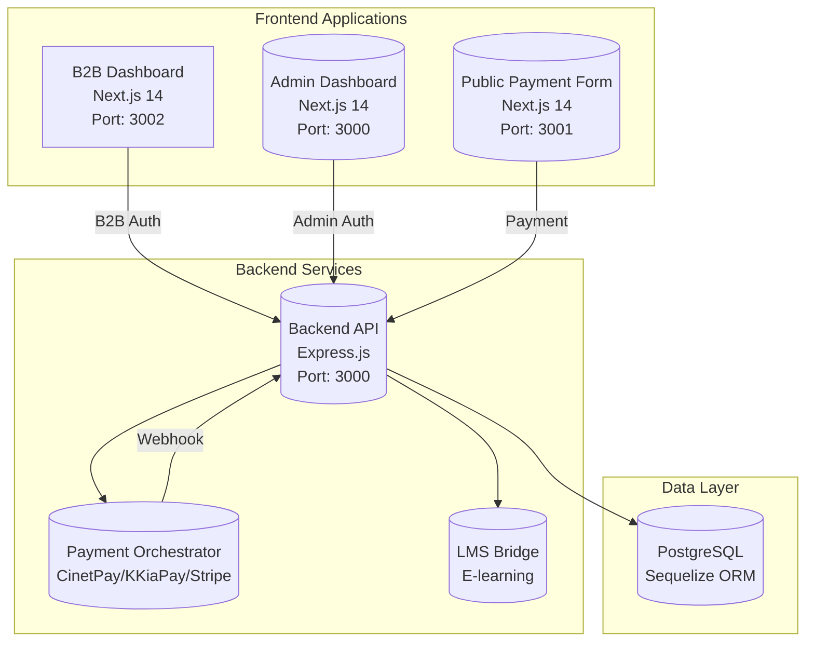
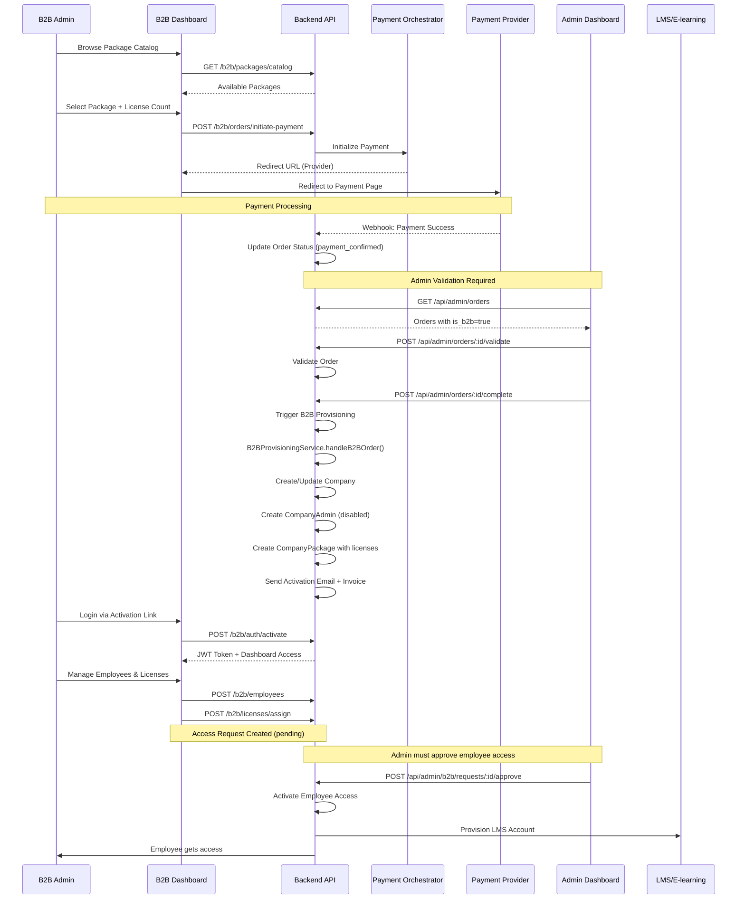
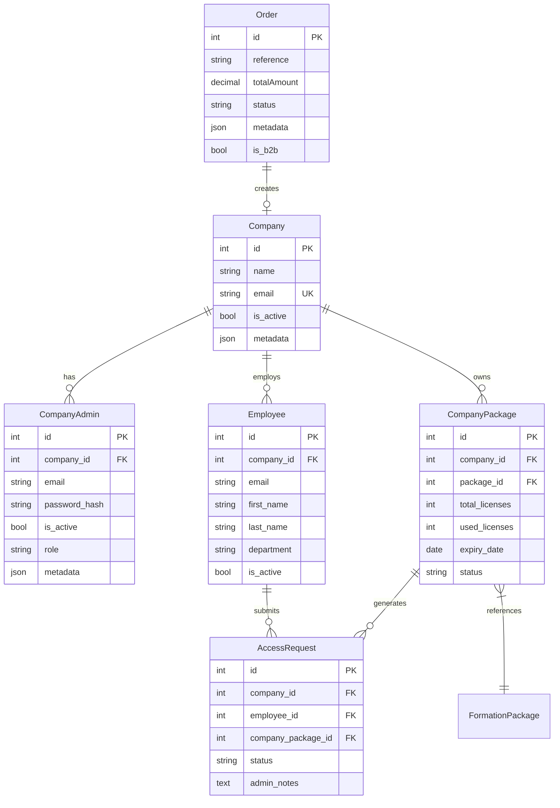

# Comprehensive B2B Ecosystem Audit Report

## Executive Summary

This report provides a thorough analysis of the B2B training platform ecosystem, including the B2B Dashboard, Admin Dashboard, and their interactions. The system is built on a modern architecture with intelligent payment orchestration, but several gaps and improvements are needed for a production-ready SAAS solution.

---

## 1. System Architecture Overview

### 1.1 Components



### 1.2 Technology Stack

| Layer | Technology |
|-------|------------|
| Frontend | Next.js 14, React, TypeScript, Tailwind CSS |
| Backend | Node.js, Express.js, Sequelize ORM |
| Database | PostgreSQL |
| Authentication | JWT (B2B & Admin) |
| Payments | CinetPay, KKiaPay, Stripe |
| State Management | TanStack Query |
| UI Components | Shadcn/UI, Lucide Icons |

---

## 2. Complete B2B Workflow Analysis

### 2.1 End-to-End B2B Purchase Flow



### 2.2 Current Order Status States

| Status | Description | Next Status |
|--------|-------------|-------------|
| `pending` | Order created, waiting for payment | `payment_confirmed`, `payment_failed` |
| `payment_confirmed` | Payment successful via webhook | `validated` (by admin) |
| `payment_failed` | Payment failed or cancelled | `pending` (retry) |
| `validated` | Admin validated the order | `completed` |
| `completed` | B2B provisioning done, email sent | Terminal |
| `rejected` | Order rejected by admin or payment | Terminal |

---

## 3. Current API Endpoints Analysis

### 3.1 B2B Dashboard Endpoints (`/api/b2b/*`)

| Endpoint | Method | Purpose | Status |
|----------|--------|---------|--------|
| `/b2b/auth/login` | POST | B2B admin login | ✅ Active |
| `/b2b/auth/activate` | POST | Activate account with token | ✅ Active |
| `/b2b/auth/me` | GET | Get current admin profile | ✅ Active |
| `/b2b/auth/profile` | PUT | Update profile | ✅ Active |
| `/b2b/auth/password` | PUT | Change password | ✅ Active |
| `/b2b/dashboard/stats` | GET | Dashboard statistics | ✅ Active |
| `/b2b/packages` | GET | Company's packages | ✅ Active |
| `/b2b/packages/catalog` | GET | Available packages | ✅ Active |
| `/b2b/packages/:id` | GET | Package details | ✅ Active |
| `/b2b/orders` | GET | Company's orders | ✅ Active |
| `/b2b/orders/:id` | GET | Order details | ✅ Active |
| `/b2b/orders/:id/invoice` | GET | Download invoice PDF | ✅ Active |
| `/b2b/orders/initiate-payment` | POST | Initiate payment (NEW) | ✅ Active |
| `/b2b/employees` | CRUD | Employee management | ✅ Active |
| `/b2b/licenses/assign` | POST | Request license for employee | ✅ Active |
| `/b2b/licenses/revoke` | POST | Revoke license | ✅ Active |
| `/b2b/requests` | GET | Access requests list | ✅ Active |
| `/b2b/requests/:id` | GET | Request details | ✅ Active |
| `/b2b/notifications` | GET | Admin notifications | ✅ Active |
| `/b2b/notifications/:id/read` | PATCH | Mark as read | ✅ Active |

### 3.2 Admin Dashboard Endpoints (`/api/admin/*`)

| Endpoint | Method | Purpose | Status |
|----------|--------|---------|--------|
| `/admin/orders` | GET | All orders | ✅ Active |
| `/admin/orders/:id` | GET | Order details | ✅ Active |
| `/admin/orders/:id/validate` | POST | Validate B2B order | ✅ Active |
| `/admin/orders/:id/complete` | POST | Complete & provision | ✅ Active |
| `/admin/companies` | GET | List companies | ✅ Active |
| `/admin/companies/:id` | GET | Company details | ✅ Active |
| `/admin/companies/:id/toggle-admin` | POST | Enable/Disable admin | ✅ Active |
| `/admin/test/b2b-orders` | POST | Create test B2B order | ⚠️ Test only |
| `/admin/test/b2b-orders/:id/simulate-payment` | POST | Simulate payment | ⚠️ Test only |
| `/admin/test/b2b-orders/:id/provision` | POST | Trigger provisioning | ⚠️ Test only |

### 3.3 Missing Admin Endpoints

| Endpoint | Purpose | Priority |
|----------|---------|----------|
| `/admin/b2b/requests` | List ALL access requests across companies | HIGH |
| `/admin/b2b/requests/:id/approve` | Approve employee access | HIGH |
| `/admin/b2b/requests/:id/reject` | Reject employee access | HIGH |
| `/admin/b2b/companies/:id/packages` | Manage company packages | MEDIUM |
| `/admin/b2b/employees` | List employees across companies | MEDIUM |
| `/admin/b2b/stats` | Global B2B analytics | MEDIUM |

---

## 4. Identified Issues and Gaps

### 4.1 Critical Issues (Must Fix)

#### Issue #1: Access Request Approve/Reject Logic Mismatch

**Location**: [`b2b-request.controller.js`](apps/backend/controllers/b2b-request.controller.js:93)

**Problem**:

- B2B Dashboard has approve/reject buttons (REMOVED - correct)
- BUT the backend still has `approve()` and `reject()` endpoints
- The comment says "TODO: Send activation email to employee" - not implemented!

**Impact**:

- When admin approves request, no email sent to employee
- No LMS provisioning triggered

**Recommendation**:

1. Move approve/reject endpoints to Admin Dashboard API (`/api/admin/b2b/requests`)
2. Implement email notification on approval
3. Trigger LMS provisioning on approval

---

#### Issue #2: Incomplete Access Request Workflow

**Location**: [`access-request.model.js`](apps/backend/models/access-request.model.js)

**Problem**:

- Access requests are created when B2B admin assigns license to employee
- But there's no unified way for Admin to view/manage ALL access requests
- The B2B dashboard can only see requests for their company

**Current Flow (Partial)**:

```javascript
// B2B Admin assigns license → Creates AccessRequest with status='pending'
// BUT: Who approves this? B2B admin or Platform admin?
```

**Missing**:

- Admin Dashboard needs a dedicated B2B requests management page
- Need to clarify: should B2B admin approve employee access, or platform admin?

**Recommendation**:

1. Clarify the workflow: Employee Access Request → B2B Admin Approval → (Optional: Platform Admin Approval) → LMS Provisioning
2. Create Admin Dashboard page for B2B requests
3. Implement automatic LMS provisioning on final approval

---

#### Issue #3: No Real B2B Order Validation in Admin

**Location**: [`admin.routes.js`](apps/backend/routes/admin.routes.js)

**Problem**:

- Admin has `/admin/orders/:id/validate` and `/admin/orders/:id/complete`
- But there's no dedicated B2B order list/filter in Admin Dashboard
- The test-b2b page is only for simulation, not production

**Missing**:

- Filter: `GET /api/admin/orders?is_b2b=true`
- Dedicated B2B orders management page
- Bulk validation/completion actions
- B2B order analytics

**Recommendation**:

1. Add is_b2b filter to admin orders API
2. Create B2B Orders management page in Admin Dashboard
3. Add quick actions: Validate, Complete, Reject
4. Add B2B-specific analytics widget

---

### 4.2 High Priority Issues

#### Issue #4: License Count Not Enforced

**Location**: [`b2b-package.controller.js`](apps/backend/controllers/b2b-package.controller.js:126)

**Problem**:

- When assigning license: `POST /b2b/licenses/assign`
- No check for available licenses before creating request

**Code Analysis**:

```javascript
// Current: Just creates request without checking
const request = await AccessRequest.create({
    company_id: companyId,
    employee_id: employeeId,
    company_package_id: packageId,
    status: 'pending'  // Always pending!
});
```

**Recommendation**:

1. Add pre-check: `if (used_licenses >= total_licenses) throw Error`
2. Auto-approve if licenses available and B2B admin approves directly
3. Or: Allow B2B admin to approve with automatic license decrement

---

#### Issue #5: No Email Notifications on Employee Access

**Location**: [`b2b-request.controller.js`](apps/backend/controllers/b2b-request.controller.js:131)

**Problem**:

- Comment says: `// TODO: Send activation email to employee`
- This is not implemented for either approve or reject

**Missing Notifications**:

- ✅ On approve: Email to employee with LMS credentials
- ✅ On reject: Email to employee with rejection reason
- ✅ On new request: Notification to B2B admin

**Recommendation**:

1. Implement `MailService.sendEmployeeAccessEmail()`
2. Include LMS login credentials in email
3. Track email delivery status

---

#### Issue #6: No LMS Integration for Employee Provisioning

**Location**: [`b2b-request.controller.js`](apps/backend/controllers/b2b-request.controller.js:97)

**Problem**:

- On approval, employee status is updated in database
- But NO call to LMS to provision actual account

**Missing**:

```javascript
// Should have:
await LmsBridgeService.provisionEmployeeAccess(employee, package);
```

**Recommendation**:

1. Create `LmsBridgeService.provisionEmployeeAccess()`
2. Integrate with existing LMS API
3. Store LMS account details in employee record

---

### 4.3 Medium Priority Issues

#### Issue #7: Payment Currency Mismatch

**Location**: [`b2b-order.controller.js`](apps/backend/controllers/b2b-order.controller.js:205)

**Problem**:

- Frontend sends `currency: displayCurrency` (XAF/EUR/USD)
- But package prices are stored in specific currency
- No currency conversion validation

**Risk**: Incorrect pricing if currencies don't match

**Recommendation**:

1. Validate currency matches package currency
2. Or: Implement real-time currency conversion
3. Show warning if currency differs from package

---

#### Issue #8: No Webhook for B2B Order Completion

**Location**: [`b2b-provisioning.service.js`](apps/backend/services/b2b-provisioning.service.js)

**Problem**:

- Provisioning happens synchronously in `complete` endpoint
- No webhook/event for external systems to subscribe

**Missing**:

- Event emission: `B2B_ORDER_PROVISIONED`
- Webhook URL configuration
- Retry mechanism for failed provisioning

**Recommendation**:

1. Add event system (EventEmitter or message queue)
2. Support webhook registration for B2B events
3. Add retry logic for failed provisioning

---

#### Issue #9: No B2B Dashboard Company Settings

**Location**: [`apps/b2b-dashboard`](apps/b2b-dashboard/src/app/[locale]/dashboard/settings/page.tsx)

**Problem**:

- B2B admin can update their personal profile
- BUT cannot update company information (name, logo, industry)

**Missing**:

- Company profile editor
- Logo upload
- Industry selection

**Recommendation**:

1. Add `PUT /api/b2b/company` endpoint
2. Create company settings tab in B2B Dashboard
3. Add logo upload functionality

---

#### Issue #10: No License Expiry Management

**Location**: [`company-package.model.js`](apps/backend/models/company-package.model.js:36)

**Problem**:

- `expiry_date` field exists but not used
- No automatic expiry enforcement
- No reminder emails before expiry

**Missing**:

- Cron job to check expiring licenses
- Warning notifications
- Auto-suspend on expiry
- Renewal workflow

**Recommendation**:

1. Implement license expiry check cron job
2. Send reminder emails 30/7/1 day before expiry
3. Auto-expire and notify on expiry date

---

## 5. Data Model Analysis

### 5.1 Entity Relationship Diagram



### 5.2 Missing Fields

| Model | Missing Field | Type | Purpose |
|-------|--------------|------|---------|
| Company | `industry` | STRING | Already in metadata, should be column |
| Company | `country` | STRING | Geographic targeting |
| CompanyAdmin | `last_login` | DATE | Security audit |
| Employee | `lms_user_id` | STRING | LMS integration |
| Employee | `phone` | STRING | Contact |
| CompanyPackage | `auto_renew` | BOOLEAN | Subscription management |
| AccessRequest | `rejection_reason` | TEXT | Already exists, but not always set |

---

## 6. Security Analysis

### 6.1 Current Security Measures ✅

| Measure | Implementation |
|---------|----------------|
| Authentication | JWT tokens with expiration |
| B2B Auth Middleware | [`b2b-admin.middleware.js`](apps/backend/middlewares/b2b-admin.middleware.js) |
| Admin Auth | Separate admin authentication |
| Input Validation | Zod schemas in validators |
| SQL Injection | Sequelize parameterized queries |
| XSS | React auto-escaping |
| CORS | Configured in Express |

### 6.2 Security Gaps ⚠️

| Issue | Severity | Recommendation |
|-------|----------|----------------|
| No rate limiting on auth endpoints | HIGH | Add rate limiting |
| No IP whitelist for B2B | MEDIUM | Add IP restriction option |
| Password reset not implemented | HIGH | Add forgot password flow |
| No 2FA for B2B admins | MEDIUM | Add 2FA support |
| Activation token expires in 24h only | LOW | Add token refresh |
| No audit logging for B2B actions | MEDIUM | Add comprehensive audit trail |

---

## 7. Recommended Action Plan

### Phase 1: Critical Fixes (Week 1-2)

| # | Action | Files to Modify |
|---|--------|-----------------|
| 1.1 | Move approve/reject to Admin API | `admin.routes.js`, create `admin-b2b-request.controller.js` |
| 1.2 | Implement employee email notifications | `mail.service.js`, `b2b-request.controller.js` |
| 1.3 | Add license count validation | `b2b-package.controller.js` |
| 1.4 | Add is_b2b filter to admin orders | `admin.routes.js` |
| 1.5 | Fix frontend (already done) | `api.ts`, `requests/page.tsx` |

### Phase 2: Core Features (Week 3-4)

| # | Action | Files to Modify |
|---|--------|-----------------|
| 2.1 | Create B2B requests page in Admin | `apps/dashboard/src/app/(dashboard)/b2b-requests/` |
| 2.2 | Implement LMS provisioning on approval | `lms-bridge.service.js` |
| 2.3 | Add company settings in B2B Dashboard | B2B settings page |
| 2.4 | Add currency validation | `b2b-order.controller.js` |

### Phase 3: Enhancement (Week 5-6)

| # | Action | Files to Modify |
|---|--------|-----------------|
| 3.1 | Add license expiry management | Cron job + notifications |
| 3.2 | Add webhook support for B2B events | `webhook.service.js` |
| 3.3 | Add audit logging | `audit-log.model.js` + middleware |
| 3.4 | Add 2FA for B2B admins | Auth flow updates |

### Phase 4: Polish (Week 7+)

| # | Action |
|---|--------|
| 4.1 | Performance optimization |
| 4.2 | Comprehensive testing |
| 4.3 | Documentation |
| 4.4 | Deployment automation |

---

## 8. Conclusion

The B2B ecosystem has a solid foundation with:

- ✅ Intelligent payment orchestration
- ✅ Separate B2B and Admin dashboards
- ✅ Complete order lifecycle management
- ✅ Invoice generation
- ✅ Email notifications for provisioning

However, there are critical gaps in:

- ❌ Access request approval workflow (who approves?)
- ❌ Employee LMS provisioning
- ❌ Email notifications for employees
- ❌ License count enforcement
- ❌ Admin Dashboard B2B management

**Priority**: Fix the access request workflow immediately as it's blocking the complete B2B employee onboarding flow.

---

*Report generated: 2026-03-17*
*Architect: AI Analysis*
*Version: 1.0*
