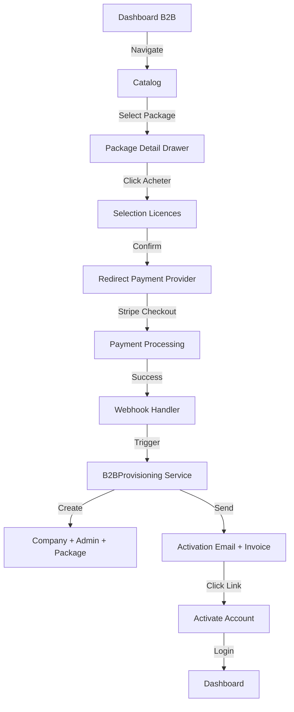

# B2B Dashboard - Audit Complet pour Production

## Résumé Exécutif

Le dashboard B2B est actuellement dans un état **partiellement fonctionnel** avec plusieurs fonctionnalités core en place mais de nombreux manques pour une mise en production premium. L'infrastructure de base est solide (Next.js 14 + TypeScript + React Query), mais il manque des éléments critiques comme le vrai flux de paiement, la gestion complète des invoices, et une expérience utilisateur polishée.
---

## 1. Analyse des Fonctionnalités Implémentées 

### Authentication & Session Management

| Fonctionnalité | Status | Fichier Référent |
|-----------------|--------|------------------|
| Login page | ✅ Opérationnel | [`login/page.tsx`](apps/b2b-dashboard/src/app/[locale]/login/page.tsx) |
| JWT token storage | ✅ Opérationnel | [`api.ts:17`](apps/b2b-dashboard/src/lib/api.ts:17) |
| Auth interceptor | ✅ Opérationnel | [`api.ts:15-37`](apps/b2b-dashboard/src/lib/api.ts:15-37) |
| Account activation | ✅ Opérationnel | [`auth/activate/page.tsx`](apps/b2b-dashboard/src/app/[locale]/auth/activate/page.tsx) |
| Logout | ❌ **Manquant** | - |
| Forgot password | ❌ **Manquant** | Lien existant mais non fonctionnel |

### ✅ Dashboard & Statistiques

| Fonctionnalité | Status | Fichier Référent |
|-----------------|--------|------------------|
| KPIs cards | ✅ Opérationnel | [`dashboard/page.tsx:76-167`](apps/b2b-dashboard/src/app/[locale]/dashboard/page.tsx:76-167) |
| Usage by package | ✅ Opérationnel | [`dashboard/page.tsx:185-222`](apps/b2b-dashboard/src/app/[locale]/dashboard/page.tsx:185-222) |
| Recent activity | ✅ Opérationnel | [`dashboard/page.tsx:225-280`](apps/b2b-dashboard/src/app/[locale]/dashboard/page.tsx:225-280) |
| Stats API | ✅ Opérationnel | [`b2b-dashboard.controller.js`](apps/backend/controllers/b2b-dashboard.controller.js) |

### ✅ Packages Management

| Fonctionnalité | Status | Fichier Référent |
|-----------------|--------|------------------|
| View owned packages | ✅ Opérationnel | [`packages/page.tsx`](apps/b2b-dashboard/src/app/[locale]/dashboard/packages/page.tsx) |
| Catalog browsing | ✅ Opérationnel | [`catalog/page.tsx`](apps/b2b-dashboard/src/app/[locale]/dashboard/catalog/page.tsx) |
| Package detail drawer | ✅ Opérationnel | [`PackageDetailDrawer.tsx`](apps/b2b-dashboard/src/components/modals/PackageDetailDrawer.tsx) |
| Purchase (simulation) | ⚠️ Simulé | [`b2b-package.controller.js:246`](apps/backend/controllers/b2b-package.controller.js:246) |
| License assignment | ✅ Opérationnel | [`AssignLicenseModal.tsx`](apps/b2b-dashboard/src/components/modals/AssignLicenseModal.tsx) |
| License revocation | ✅ Backend only | [`b2b-package.controller.js:202`](apps/backend/controllers/b2b-package.controller.js:202) |

### ✅ Équipe & Employees

| Fonctionnalité | Status | Fichier Référent |
|-----------------|--------|------------------|
| List employees | ✅ Opérationnel | [`team/page.tsx`](apps/b2b-dashboard/src/app/[locale]/dashboard/team/page.tsx) |
| Add employee modal | ✅ Opérationnel | [`AddEmployeeModal.tsx`](apps/b2b-dashboard/src/components/modals/AddEmployeeModal.tsx) |
| Delete employee | ✅ Opérationnel | [`team/page.tsx:45-68`](apps/b2b-dashboard/src/app/[locale]/dashboard/team/page.tsx:45-68) |
| Edit employee | ❌ UI exists but not connected | [`team/page.tsx:137`](apps/b2b-dashboard/src/app/[locale]/dashboard/team/page.tsx:137) |

### ✅ Requests & Access

| Fonctionnalité | Status | Fichier Référent |
|-----------------|--------|------------------|
| View requests | ✅ Opérationnel | [`requests/page.tsx`](apps/b2b-dashboard/src/app/[locale]/dashboard/requests/page.tsx) |
| Filter by status | ✅ Opérationnel | [`requests/page.tsx:77-114`](apps/b2b-dashboard/src/app/[locale]/dashboard/requests/page.tsx:77-114) |
| Approve/Reject | ❌ **Manquant API** | - |

###  Historique & Facturation

| Fonctionnalité | Status | Fichier Référent |
|-----------------|--------|------------------|
| Transaction history | ⚠️ Partiel | [`history/page.tsx`](apps/b2b-dashboard/src/app/[locale]/dashboard/history/page.tsx) |
| Invoice download button | ❌ Non connecté | [`history/page.tsx:78-80`](apps/b2b-dashboard/src/app/[locale]/dashboard/history/page.tsx:78-80) |
| Invoice PDF generation | ✅ Backend | [`InvoiceService`](apps/backend/services/invoice.service.js) |

###  Paramètres (Settings)

| Fonctionnalité | Status | Fichier Référent |
|----------------|--------|------------------|
| View profile | ⚠️ Partiel | [`settings/page.tsx`](apps/b2b-dashboard/src/app/[locale]/dashboard/settings/page.tsx) |
| Edit profile | ❌ Non fonctionnel | [`settings/page.tsx:113-117`](apps/b2b-dashboard/src/app/[locale]/dashboard/settings/page.tsx:113-117) |
| Change password | ❌ **Manquant** | - |
| Security settings | ❌ **Manquant** | - |
| Notification preferences | ❌ **Manquant** | - |

---

## 2. Points de Friction Critiques

### 🔴 CRITIQUE - Flux de Paiement B2B

**Problème:** L'achat de packages via le dashboard est actuellement **simulé** et ne déclenche pas de vrai paiement.

```javascript
// backend/controllers/b2b-package.controller.js:246-308
purchasePackage: async (req, res, next) => {
  // Crée directement le package sans passer par un provider de paiement
  const companyPackage = await CompanyPackage.create({...});
  // Pas de redirection vers Stripe/CinetPay/KKiaPay
}
```

**Impact:** Aucune revenus réels possible. Le workflow devrait être:

1. Sélection du package → 2. Nombre de licences → 3. Paiement réel → 4. Activation

### 🔴 CRITIQUE - Téléchargement de Factures

**Problème:** Le bouton "Télécharger" existe dans l'historique mais aucun appel API n'est implémenté.

```tsx
// dashboard/history/page.tsx:78-80
<button className="p-2 rounded-xl text-text-muted hover:text-primary hover:bg-primary/10 transition-all">
  <Download className="h-5 w-5" />
</button>
```

**Solution requise:** Créer un endpoint `/api/v1/b2b/orders/:id/invoice` et connecter le bouton.

### 🟠 IMPORTANT - Gestion des Demandes d'Accès

**Problème:** Les administrateurs B2B ne peuvent pas approuver ou rejeter les demandes d'accès de leurs employés.

**État actuel:**

- Les employés font des demandes (via le portal employé?)
- Les admins voient les demandes mais ne peuvent pas les traiter
- Le statut passe de "pending" → "processing" → "activated" automatiquement?

**API manquante:** `PUT /api/v1/b2b/requests/:id/approve` et `reject`

### 🟠 IMPORTANT - Édition de Profil

**Problème:** Le formulaire de paramètres affiche les données mais le bouton "Enregistrer" ne fait rien.

```tsx
// settings/page.tsx:112-117
<button className="btn btn-primary shadow-glow">
  <Save className="h-4 w-4" />
  Enregistrer les modifications
</button>
// Pas de mutation ou d'appel API connecté
```

---

## 3. Fonctionnalités Manquantes pour Production

### Priorité Haute (P0 - Bloquant)

| # | Fonctionnalité | Description |
|---|----------------|-------------|
| 1 | **Paiement Réel B2B** | Intégration Stripe/KKiaPay/CinetPay pour achat de packages |
| 2 | **API Factures** | Génération + téléchargement PDF des factures |
| 3 | **Traitement Demandes** | Approbation/Rejet des accès par les admins |
| 4 | **Mise à jour Profil** | Edit du nom, prénom, email company |

### Priorité Moyenne (P1 - Important)

| # | Fonctionnalité | Description |
|---|----------------|-------------|
| 5 | **Logout** | Déconnexion fonctionnelle avec cleanup token |
| 6 | **Mot de passe oublié** | Flow complet de reset password |
| 7 | **Changement mot de passe** | Dans les paramètres de sécurité |
| 8 | **Notifications** | Centre de notifications avec marqueurs lu/non-lu |
| 9 | **Revoke License UI** | Interface pour révoquer des licences |

### Priorité Basse (P2 - Nice to Have)

| # | Fonctionnalité | Description |
|---|----------------|-------------|
| 10 | **2FA** | Double authentification pour les admins |
| 11 | **Audit Log** | Historique des actions admin |
| 12 | **Export CSV** | Export des données équipe/licences |
| 13 | **Bulk Operations** | Ajout multiple d'employés |
| 14 | **Analytics** | Graphiques avancés d'utilisation |
| 15 | **Dark Mode** | Theme toggle complètement fonctionnel |

---

## 4. Architecture Recommandée

### Workflow d'Achat B2B Premium



### Structure des Données Requise

```typescript
// Modèle de commande B2B enrichi
interface B2BOrder {
  id: number;
  reference: string;
  company_id: number;
  company_name: string;
  company_admin_email: string;
  package_id: number;
  total_licenses: number;
  price_per_license: number;
  total_amount: number;
  currency: 'XOF' | 'EUR';
  status: 'pending_payment' | 'paid' | 'failed' | 'refunded';
  payment_provider: 'stripe' | 'cinetpay' | 'kkiapay';
  payment_intent_id: string;
  invoice_url: string;
  created_at: Date;
  paid_at: Date;
}
```

---

## 5. Plan d'Action Détaillé

### Phase 1: Core Payment (Semaine 1-2)

#### 1.1 Créer l'API de Paiement B2B

```bash
# Endpoints à créer:
POST /api/v1/b2b/orders/create-checkout-session
POST /api/v1/b2b/orders/webhook
GET  /api/v1/b2b/orders/:id/invoice
GET  /api/v1/b2b/orders
```

#### 1.2 Intégrer Stripe dans le Dashboard

- Ajouter `stripe-js` et `@stripe/react-stripe-js`
- Créer composant `PaymentModal`
- Gérer le flux:选择 → Paiement → Confirmation

#### 1.3 Génération de Factures

- Endpoint `/api/v1/b2b/orders/:id/invoice`
- Retourne PDF stream
- Connecter au bouton dans History

### Phase 2: Gestion des Accès (Semaine 2-3)

#### 2.1 API de Traitement des Demandes

```javascript
// POST /api/v1/b2b/requests/:id/approve
// POST /api/v1/b2b/requests/:id/reject
// GET /api/v1/b2b/requests/:id
```

#### 2.2 UI d'Approbation

- Ajouter boutons dans Requests page
- Ajouter modal de confirmation
- Notifications aux employés

### Phase 3: Paramètres & Sécurité (Semaine 3-4)

#### 3.1 Profile Management

- PUT `/api/v1/b2b/auth/profile`
- PUT `/api/v2/b2b/auth/password`

#### 3.2 Logout & Session

- POST `/api/v1/b2b/auth/logout`
- Clear localStorage + redirect

#### 3.3 Forgot Password

- POST `/api/v1/b2b/auth/forgot-password`
- POST `/api/v1/b2b/auth/reset-password`

### Phase 4: Polish & Production (Semaine 4+)

- Tests E2E avec Playwright
- Monitoring (Sentry)
- SEO & Meta tags
- Performance optimization
- Documentation

---

## 6. Recommandations Techniques

### Stack Recommandée

| Catégorie | Actuel | Recommandé |
|-----------|--------|------------|
| State | React Query | Keep + add React Context for auth |
| Forms | Native | React Hook Form + Zod |
| UI | Custom + Tailwind | Ajouter Shadcn/UI |
| Payments | Simulation | Stripe Connect |
| Email | Nodemailer | Resend ou SendGrid |
| PDF | Puppeteer | Keep (ou PDFKit) |

### Points d'Attention Sécurisés

1. **JWT Tokens**: Ajouter refresh token rotation
2. **CORS**: Restreindre origins autorisées
3. **Rate Limiting**: Implémenter sur endpoints auth
4. **Validation**: Utiliser Zod pour toutes les inputs
5. **Audit**: Logger toutes les actions sensibles

---

## 7. Conclusion

Le dashboard B2B possède une **base solide** avec une UI moderne et une architecture correcte. Cependant, pour atteindre le niveau **production-ready premium**, il faut impérativement:

1. ✅ Implémenter le vrai flux de paiement
2. ✅ Connecter la génération de factures
3. ✅ Ajouter la gestion des demandes d'accès
4. ✅ Finaliser les paramètres utilisateur

Une fois ces éléments críticos addressés, le dashboard sera opérationnel pour des clients B2B réels.

---

*Audit réalisé le 18 Mars 2026*
*Expert: Architecture SI & FullStack*
