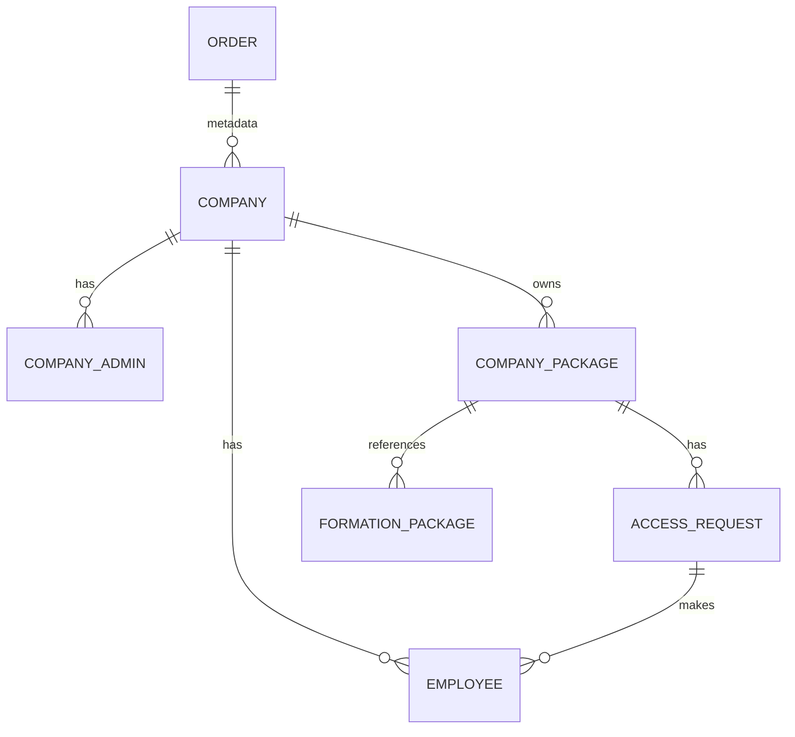

# 📊 ANALYSE COMPLÈTE DU WORKFLOW B2B D'ACHAT DE PACKAGES DE FORMATIONS

## Résumé Exécutif

Le workflow B2B d'achat de packages utilise le **système de paiement existant** avec l'orchestrateur. Ce n'est PAS une simulation séparée.

### Workflow Réel:

```
Entreprise B2B → Catalog → POST /b2b/orders/initiate-payment
                                                ↓
                             OrchestratorService.initializePayment()
                                                ↓
                             Order créé avec metadata: is_b2b=true
                                                ↓
                             Redirect vers Stripe/KKiaPay/CinetPay
                                                ↓
                             [Paiement via Provider]
                                                ↓
                             Webhook → Order status: payment_confirmed
                                                ↓
                             POST /admin/orders/:id/validate (Admin)
                                                ↓
                             POST /admin/orders/:id/complete (Admin)
                                                ↓
                             B2BProvisioningService.handleB2BOrder()
                                                ↓
                             1. Company.findOrCreate()
                             2. CompanyAdmin.create (disabled)
                             3. CompanyPackage.create
                             4. Send Activation Email + Invoice PDF
```

---

## 1. DIAGRAMME DU WORKFLOW

```mermaid
flowchart TD
    %% PHASE 1: ACHAT
    START([<b>Début: Entreprise B2B</b>]) --> B2B_AUTH[Login / Dashboard]
    B2B_AUTH --> CATALOG[Catalog Packages]
    CATALOG -->|Select package + nb licences| INIT_PMT[POST /b2b/orders/initiate-payment]

    %% PHASE 2: PAIEMENT
    INIT_PMT --> ORCH[OrchestratorService.initializePayment]
    ORCH -->|Crée Order| CREATE_ORD[Order: pending, is_b2b=true]
    CREATE_ORD --> PROVIDER[Stripe/KKiaPay/CinetPay]
    PROVIDER --> PMT[Page Paiement]
    PMT -->|<b> Succès </b>| WEBHOOK[Webhook: payment_confirmed]
    WEBHOOK --> UPDATE[Order: payment_confirmed]

    %% PHASE 3: VALIDATION ADMIN
    UPDATE --> ADMIN_VAL[POST /admin/orders/:id/validate]
    ADMIN_VAL --> VAL_EMAIL[MailService.sendOrderValidated]
    VAL_EMAIL --> ADMIN_COMPLE[POST /admin/orders/:id/complete]

    %% PHASE 4: PROVISIONING B2B
    ADMIN_COMPLE --> PROVISION[B2BProvisioningService.handleB2BOrder]
    PROVISION --> CO[Company.findOrCreate]
    CO --> ADMIN[CompanyAdmin.create disabled]
    ADMIN --> CP[CompanyPackage.create]
    CP --> EMAIL[Send Activation + Invoice]

    %% PHASE 5: ACTIVATION
    EMAIL --> ACTIVATE[/auth/activate?token=xxx]
    ACTIVATE --> PASS[Create password]
    PASS --> ASSIGN[Assign License to Employees]
    ASSIGN --> LMS[ LMS: Accès Formations]
    LMS --> FIN([<b>Fin</b>])

    %% STYLES
    style START fill:#e8f5e9,stroke:#2e7d32
    style PMT fill:#fff3e0,stroke:#f57c00
    style WEBHOOK fill:#ffebee,stroke:#c62828
    style ADMIN_VAL fill:#f3e5f5,stroke:#7b1fa2
    style PROVISION fill:#e3f2fd,stroke:#1565c0
    style LMS fill:#e0f2f1,stroke:#00695c
    style FIN fill:#c8e6c9,stroke:#2e7d32
```

---

## 2. ÉTAPES DÉTAILLÉES

### ÉTAPE 1: Initiation Paiement B2B

**API:** `POST /api/v1/b2b/orders/initiate-payment`

**Controller:** [`b2b-order.controller.js:318-401`](apps/backend/controllers/b2b-order.controller.js:318)

```javascript
// apps/backend/controllers/b2b-order.controller.js:318-401
initiatePayment: async (req, res, next) => {
  const { package_id, total_licenses, paymentMethod, countryCode, currency } =
    req.body;
  const companyId = req.company_id;
  const companyEmail = req.company_email;
  const companyName = req.company_name;

  // Get package details
  const pkg = await FormationPackage.findByPk(package_id);
  const unitPrice = Number(pkg.price) || 0;
  const totalAmount = unitPrice * total_licenses;

  // Prepare payment data with B2B metadata
  const paymentData = {
    customerEmail: companyEmail,
    customerName: companyName,
    lmsItemId: package_id.toString(),
    lmsItemType: "package", // ← Important!
    paymentMethod: paymentMethod || "card",
    countryCode: countryCode || "CM",
    currency: currency || pkg.currency || "XOF",
    amount: totalAmount,
    metadata: {
      is_b2b: true,
      b2b_purchase: true,
      company_id: companyId,
      company_name: companyName,
      company_admin_email: companyEmail,
      licence_count: total_licenses,
      unit_price: unitPrice,
      source: "b2b_dashboard",
    },
  };

  // Call the intelligent payment orchestrator
  const result = await OrchestratorService.initializePayment(paymentData);

  // Returns: orderReference, redirectUrl, provider
  res.json({
    orderReference: result.orderReference,
    redirectUrl: result.redirectUrl,
    provider: result.provider,
  });
};
```

| Paramètre      | Type   | Description              |
| -------------- | ------ | ------------------------ |
| package_id     | number | ID du package            |
| total_licenses | number | Nombre de licences       |
| paymentMethod  | string | "card" ou "mobile_money" |
| countryCode    | string | Code pays (CM, SN, etc.) |
| currency       | string | XOF, XAF, EUR            |

---

### ÉTAPE 2: Orchestrateur Paiement

**Service:** [`orchestrator.service.js`](apps/backend/services/orchestrator.service.js)

```javascript
// apps/backend/services/orchestrator.service.js
static async initializePayment(data) {
  const { lmsItemType, metadata } = data;

  // Ajoute les metadata B2B
  const finalMetadata = {
    ...metadata,
    b2b_purchase: lmsItemType === 'package',
    is_b2b: lmsItemType === 'package' || !!metadata.company_name,
    backendLicenceCount: actualLicenceCount,
  };

  // Crée un Order dans la table orders
  const order = await Order.create({
    reference: generateReference(),
    customerEmail: data.customerEmail,
    customerName: data.customerName,
    amount: data.amount,
    currency: data.currency,
    status: OrderStatus.PENDING,
    lmsItemId: data.lmsItemId,
    lmsItemType: data.lmsItemType, // "package"
    formationId: data.lmsItemId,
    metadata: finalMetadata,
  });

  // Appelle le provider (Stripe/KKiaPay/CinetPay)
  const providerResult = await this.selectAndCallProvider(order, data);
  return providerResult;
}
```

---

### ÉTAPE 3: Webhook Paiement Confirmé

**Service:** [`webhook-processor.service.js`](apps/backend/services/webhook-processor.service.js)

```javascript
// apps/backend/services/webhook-processor.service.js:180-182
// Quand Payment Provider notifie succès:
try {
  await B2BProvisioningService.handleB2BOrder(order);
} catch (err) {
  console.error("[Webhook] B2B Provisioning failed:", err);
}
```

**Flow:**

1. Provider envoie webhook (payment success)
2. `WebhookProcessor` met à jour Order: `payment_confirmed`
3. Si `is_b2b=true` → appelle `B2BProvisioningService.handleB2BOrder(order)`

---

### ÉTAPE 4: Validation Admin

**API:** `POST /api/admin/orders/:id/validate`

**Controller:** [`order.controller.js:124-250`](apps/backend/controllers/order.controller.js:124)

```javascript
static async validate(req, res, next) {
  const { id } = req.params;
  const { action, notes } = req.body;
  // action: "validate" ou "reject"

  const order = await Order.findByPk(id);

  if (action === "validate") {
    // Passe en VALIDATED
    await order.update({
      status: OrderStatus.VALIDATED,
      validatedAt: new Date(),
    });

    // Envoie email avec FACTURE
    await MailService.sendOrderValidated(order);
  }
}
```

**Status Order:**

- PENDING → PAYMENT_CONFIRMED (webhook) → VALIDATED (admin) → COMPLETED (admin)

---

### ÉTAPE 5: Completion + Provisioning B2B

**API:** `POST /api/admin/orders/:id/complete`

**Controller:** [`order.controller.js:256`](apps/backend/controllers/order.controller.js:256)

```javascript
static async complete(req, res, next) {
  const { id } = req.params;
  const { username, password } = req.body;

  const order = await Order.findByPk(id);

  // Vérifie B2B order
  const metadata = order.metadata || {};
  const isB2B = metadata.is_b2b === true || metadata.b2b_purchase === true;

  if (isB2B) {
    // Trigger B2B Provisioning
    await B2BProvisioningService.handleB2BOrder(order);
  }
}
```

---

### ÉTAPE 6: B2B Provisioning Service

**Service:** [`b2b-provisioning.service.js`](apps/backend/services/b2b-provisioning.service.js)

```javascript
// apps/backend/services/b2b-provisioning.service.js:12-113
static async handleB2BOrder(order) {
  const metadata = order.metadata || {};
  const companyName = metadata.company_name;
  const adminEmail = metadata.company_admin_email;

  // 1. Create or Find Company
  let company = await Company.findOne({ where: { email: adminEmail } });
  if (!company) {
    company = await Company.create({
      name: companyName,
      email: adminEmail,
    });
  }

  // 2. Create CompanyAdmin (disabled, en attente activation)
  const activationToken = crypto.randomBytes(32).toString('hex');
  let admin = await CompanyAdmin.findOne({ where: { email: adminEmail } });
  if (!admin) {
    admin = await CompanyAdmin.create({
      company_id: company.id,
      email: adminEmail,
      password_hash: "AWAITING_ACTIVATION_...",
      is_active: false,
      metadata: { activation_token: activationToken },
    });
  }

  // 3. Create CompanyPackage
  await CompanyPackage.create({
    company_id: company.id,
    package_id: order.formationId,
    total_licenses: metadata.licence_count || 1,
    status: 'active',
  });

  // 4. Send Activation Email with Invoice
  await this.sendActivationEmail(admin, company, activationToken, order);
}
```

---

### ÉTAPE 7: Envoi Email avec Facture

**Service:** [`b2b-provisioning.service.js:118-173`](apps/backend/services/b2b-provisioning.service.js:118)

```javascript
// apps/backend/services/b2b-provisioning.service.js
static async sendActivationEmail(admin, company, token, order) {
  // Génère invoice PDF
  const pdfBuffer = await InvoiceService.generateInvoiceBuffer(null, order);

  // Envoie email avec facture jointe
  const html = `
    <div>
      <h1>Bienvenue sur votre Dashboard B2B</h1>
      <p>Votre achat de package de formations a été validé.</p>
      <a href="${dashboardUrl}/auth/activate?token=${token}&email=${admin.email}">
        Activer mon Espace B2B
      </a>
    </div>
  `;

  await MailService.sendEmail({
    to: admin.email,
    subject: `Activez votre espace B2B - ${company.name}`,
    html,
    attachments: [{ filename: `facture-${order.reference}.pdf`, content: pdfBuffer }]
  });
}
```

**Invoice Service:** [`invoice.service.js`](apps/backend/services/invoice.service.js)

```javascript
// apps/backend/services/invoice.service.js:15-30
static async generateInvoiceBuffer(intent, order) {
  const isB2B = order.lmsItemType === 'package' ||
      (order.metadata && (order.metadata.is_b2b || order.metadata.b2b_purchase));

  return isB2B
    ? this.generateB2BInvoiceBuffer(intent, order, {...})
    : this.generateStandardInvoiceBuffer(intent, order);
}
```

---

## 3. TABLES & RELATIONS

### Schéma Database



### Tables Impliquées

| Table                 | Modèle           | Description            |
| --------------------- | ---------------- | ---------------------- |
| `orders`              | Order            | Commandes (tous types) |
| `sl_companies`        | Company          | Entreprises B2B        |
| `sl_company_admins`   | CompanyAdmin     | Admins entreprises     |
| `sl_employees`        | Employee         | Employés               |
| `sl_company_packages` | CompanyPackage   | Packages achetés       |
| `sl_access_requests`  | AccessRequest    | Demandes accès         |
| `course_packages`     | FormationPackage | Packages dispo         |

---

## 4. API ENDPOINTS

### B2B Orders

| Method | Endpoint                              | Description             |
| ------ | ------------------------------------- | ----------------------- |
| POST   | `/api/v1/b2b/orders/initiate-payment` | Initie paiement package |

### Admin Orders

| Method | Endpoint                             | Description                 |
| ------ | ------------------------------------ | --------------------------- |
| GET    | `/api/admin/orders`                  | Liste commandes             |
| GET    | `/api/admin/orders/:id`              | Détail commande             |
| POST   | `/api/admin/orders/:id/validate`     | Valide commande             |
| POST   | `/api/admin/orders/:id/complete`     | Complete + Provisioning B2B |
| GET    | `/api/admin/orders/:id/provisioning` | Statut provisioning         |

### B2B Packages

| Method | Endpoint                                | Description        |
| ------ | --------------------------------------- | ------------------ |
| GET    | `/api/v1/b2b/packages/catalog`          | Catalogue packages |
| POST   | `/api/v1/b2b/packages/:id/add-licenses` | Ajouter licences   |

### B2B Licences

| Method | Endpoint                      | Description       |
| ------ | ----------------------------- | ----------------- |
| POST   | `/api/v1/b2b/licenses/assign` | Attribuer licence |
| POST   | `/api/v1/b2b/licenses/revoke` | Révoquer licence  |

---

## 5. FICHIERS CLÉS

| Fichier                                                                                                            | Description                 |
| ------------------------------------------------------------------------------------------------------------------ | --------------------------- |
| [`apps/backend/controllers/b2b-order.controller.js:318`](apps/backend/controllers/b2b-order.controller.js:318)     | initiatePayment B2B         |
| [`apps/backend/services/orchestrator.service.js`](apps/backend/services/orchestrator.service.js)                   | Orchestrateur paiement      |
| [`apps/backend/services/webhook-processor.service.js:180`](apps/backend/services/webhook-processor.service.js:180) | Webhook + provisioning      |
| [`apps/backend/services/b2b-provisioning.service.js`](apps/backend/services/b2b-provisioning.service.js)           | Full B2B provisioning       |
| [`apps/backend/services/invoice.service.js`](apps/backend/services/invoice.service.js)                             | Génération invoices         |
| [`apps/backend/routes/admin.routes.js:719`](apps/backend/routes/admin.routes.js:719)                               | Validate/Complete endpoints |
| [`apps/backend/controllers/order.controller.js:124`](apps/backend/controllers/order.controller.js:124)             | validate()                  |
| [`apps/backend/controllers/order.controller.js:256`](apps/backend/controllers/order.controller.js:256)             | complete()                  |

---

## 6. INCOHÉRENCES IDENTIFIÉES

### 🔴 Critique

| #   | Problème                                                   | Localisation                                                                              |
| --- | ---------------------------------------------------------- | ----------------------------------------------------------------------------------------- |
| C1  | Achat via `/b2b/packages/purchase` est SIMULÉ              | [`b2b-package.controller.js:246`](apps/backend/controllers/b2b-package.controller.js:246) |
| C2  | Utiliser `/b2b/orders/initiate-payment` pour vrai paiement | [`b2b-order.controller.js:318`](apps/backend/controllers/b2b-order.controller.js:318)     |

### 🟡 Modérer

| #   | Problème                                               | Localisation                                                                              |
| --- | ------------------------------------------------------ | ----------------------------------------------------------------------------------------- |
| M1  | Pas de validation max_licenses vs package.max_licenses | [`b2b-order.controller.js`](apps/backend/controllers/b2b-order.controller.js)             |
| M2  | AccessRequest toujours status='pending' hardcoded      | [`b2b-package.controller.js:208`](apps/backend/controllers/b2b-package.controller.js:208) |

---

## 7. FLOW CORRIGÉ (À UTILISER)

```
Pour acheter un package B2B avec vrai paiement:

1. Frontend B2B Dashboard:
   POST /api/v1/b2b/orders/initiate-payment
   {
     package_id: 16,
     total_licenses: 5,
     paymentMethod: "card",
     countryCode: "CM",
     currency: "XOF"
   }

2. Backend:
   ├── OrchestratorService.initializePayment()
   ├── Order.create(is_b2b=true, lmsItemType="package")
   └── Retourne redirectUrl vers provider

3. Paiement via Provider (Stripe/KKiaPay/CinetPay)

4. Webhook → Order: payment_confirmed

5. Admin Dashboard:
   POST /api/admin/orders/:id/validate
   POST /api/admin/orders/:id/complete

6. B2BProvisioningService.handleB2BOrder():
   ├── Company.findOrCreate()
   ├── CompanyAdmin.create(disabled)
   ├── CompanyPackage.create()
   └── Email activation + Invoice PDF
```

---

_Document généré le 2026-04-01_
_Projet: Agregateur de Paiement - B2B Dashboard_
