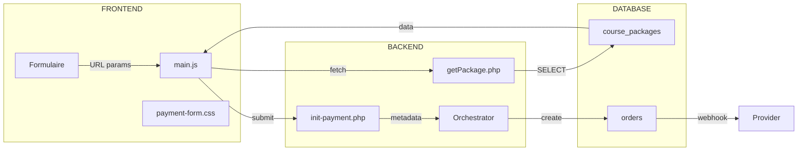

# 🚀 PLAN TRAVAIL: Formulaire de Paiement "Hyper Intelligent" pour Packages B2B

## Vision

Transformer le formulaire de paiement en une expérience **hyper intelligente** qui:

- **S'adapte dynamiquement** selon le type d'achat (formation vs package)
- **Guide l'utilisateur** à travers un flux intuitif
- **Valide en temps réel** les informations entreprise
- **Calcule automatiquement** les prix (licences × tarif)
- **Affiche les informations pertinentes** de manière claire
- **Fournit un reçu/facture** professionnel

---

## 1. ÉTAT ACTUEL - DIAGNOSTIC

### 1.1 Cartographie des Pages Existantes

```
apps/formulaire-payement/
├── index.html              # Page principale
├── index_snippet_code.html # Version avec code vérification
├── success.html          # Page succès
├── failed.html          # Page échec
├── cancel.html          # Page annulation
├── css/
│   └── payment-form.css   # 30KB - Style global
└── js/
    └── main.js          # 41KB - Logique principale
```

### 1.2 Problèmes Identifiés

| #   | Problème                                | Impact                           | Sévérité  |
| --- | --------------------------------------- | -------------------------------- | --------- |
| P1  | getPackage.php - Requête SQL incomplète | Package non affiché complètement | 🔴 HIGH   |
| P2  | Pas de validation corporate temps réel  | Erreurs détectées trop tard      | 🔴 HIGH   |
| P3  | Section corporate minimaliste           | Expérience B2B faible            | 🟠 MEDIUM |
| P4  | Pas de calcul dynamique licence         | Prix parfois erroné              | 🟠 MEDIUM |
| P5  | Pas d'indication "Package" dominante    | Confusion utilisateur            | 🟠 MEDIUM |
| P6  | Pas de résumé visuel attractif          | Moins de conversions             | 🟡 LOW    |
| P7  | Pas de facturation entreprise           | Professionnalisme insuffisant    | 🟡 LOW    |

---

## 2. CONCEPTION UI/UX

### 2.1 Architecture des Étapes (Workflow)

```mermaid
flowchart TD
    START[Début] --> DETECT{Type d'achat?}
    DETECT -->|Formation| INFOS1[Informations Client]
    DETECT -->|Package| INFOS2[Informations + Entreprise]

    subgraph ÉTAPE1
    INFOS1
    INFOS2
    end

    INFOS2 --> VALIDATE[Validation Temps Réel]
    VALIDATE --> CHECK[Vérif License Count]
    CHECK -->|OK| PRICING[Calcul Prix]

    subgraph ÉTAPE2
    PRICING
    end

    PRICING --> EMAIL[Vérification Email]

    subgraph ÉTAPE3
    EMAIL
    end

    EMAIL --> PAYMENT[Sélection Paiement]

    subgraph ÉTAPE4
    PAYMENT
    end

    PAYMENT --> WAIT[Attente Provider]
    WAIT --> SUCCESS[Félicitations + Invoice]

    STYLE START fill:#e8f5e9
    STYLE INFOS2 fill:#e3f2fd
    STYLE VALIDATE fill:#fff3e0
    STYLE PRICING fill:#f3e5f5
    STYLE SUCCESS fill:#c8e6c9
```

### 2.2 wireframes Proposées

#### Étape 1: Informations (Package)

```
┌──────────────────────────────────────────────────────────┐
│  ●●●──●──●                                                 │
│                                                             │
│  INFORMATIONS ENTREPRISE (PACKAGE B2B)                    │
│  ─────────────────────────────────────────                 │
│                                                             │
│  ┌────────────────────────────────────────────┐           │
│  │ 🏢 Nom de l'entreprise *                   │           │
│  │ [Entrez le nom de votre société          ]     │           │
│  │ ✓ Nom vérifié dans la base              │           │
│  └────────────────────────────────────────────┘           │
│                                                             │
│  ┌────────────────────┐ ┌────────────────────┐            │
│  │ 🏭 Secteur        │ │ 👥 Taille        │                    │
│  │ [Technologie   ▼] │ │ [1-10 employ ◉ ] │            │
│  └────────────────────┘ └────────────────────┘            │
│                                                             │
│  📧 Email administratif *                                │
│  [admin@entreprise.com                          ]           │
│  > Sera utilisé pour le dashboard                       │
│                                                             │
│  ─────────────────────────────────────────             │
│                                                             │
│  👤 INFORMATIONS RESPONSABLE                           │
│  [Jean Dupont                         ]           │
│  [jean@entreprise.com                 ]           │
│  [+237 6XX XXX XXX                  ]           │
│                                                             │
│  ┌────────────────────────────────────────────┐           │
│  │ Nombre de licences: [5] [-] [+]           │           │
│  │ 💰 Prix: 5 × 150,000 XAF = 750,000   │           │
│  └────────────────────────────────────────────┘           │
│                                                             │
│            [CONTINUER →]                                │
└──────────────────────────────────────────────────────────┘
```

#### Étape 2: Résumé & Confirmation

```
┌──────────────────────────────────────────────────────────┐
│                                                             │
│  RÉSUMÉ DE VOTRE COMMANDE                               │
│  ─────────────────────────────────────                 │
│                                                             │
│  ┌────────────────────────────────────────┐             │
│  │ 📦 PACKAGE FORMATIONS ENTREPRISE       │             │
│  │                                    │             │
│  │ • 5 formations incluses             │             │
│  │ • 10 licences équipes               │             │
│  │ • Support dédié                   │             │
│  │ • Certification                   │             │
│  │                                    │             │
│  │ 🏢 Entreprise: TechCorp SARL       │             │
│  │ 👤 Contact: Jean Dupont           │             │
│  └────────────────────────────────────────┘             │
│                                                             │
│  ────────────────���────────────────────                 │
│                                                             │
│  💵 DÉTAIL PRIX                                     │
│  ─────────────────────────────────────                 │
│  Package Premium (5 licences)    750,000 XAF        │
│  ─────────────────────────────────────              │
│  TOTAL                                   750,000    │
│                                                             │
│  ┌────────────────────────────────────────┐            │
│  │ ❓ Comment souhaitez-vous payer?       │            │
│  │                                       │            │
│  │ ○💳 Carte Bancaire                   │            │
│  │ ○📱 Mobile Money (MTN/Orange)     │            │
│  └────────────────────────────────────────┘            │
│                                                             │
│            [PROCÉDER AU PAIEMENT →]                     │
└──────────────────────────────────────────────────────────┘
```

### 2.3 Liste des Composants UI à Créer/Modifier

| #   | Composant             | Description                              | Priorité |
| --- | --------------------- | ---------------------------------------- | -------- |
| C1  | **PackageBadge**      | Badge visuel "PACKAGE B2B"               | HIGH     |
| C2  | **CorporateCard**     | Carte infos entreprise avec vérification | HIGH     |
| C3  | **LicenceCounter**    | Stepper +-/ avec calcul prix live        | HIGH     |
| C4  | **PriceSummary**      | Tableau récapitulatif tarifs             | HIGH     |
| C5  | **IndustrySelector**  | Dropdown secteurs prédefinis             | MEDIUM   |
| C6  | **CompanySizeSlider** | Slider taille entreprise                 | MEDIUM   |
| C7  | **PaymentSelector**   | Sélecteur méthode avec icônes            | MEDIUM   |
| C8  | **InvoicePreview**    | Aperçu facture avant paiement            | LOW      |

---

## 3. CONCEPTION TECHNIQUE (SI)

### 3.1 Architecture des Données



### 3.2 Schéma de Données Package (Étendu)

```php
// Nouveau getPackage.php - Requête complète
$query = $pdo->prepare("
    SELECT
        p.id,
        p.name AS package_name,  --兼容 title → name
        p.description,
        p.price AS unit_price,
        p.currency,
        p.max_licenses,
        p.image_url,
        p.target_audience,  -- 'entreprises', 'particuliers', 'mixed'
        p.status,
        p.created_at,

        -- Inclusions (formations comprises)
        (SELECT JSON_ARRAYAGG(
            JSON_OBJECT(
                'id', f.id,
                'name', f.name,
                'duration_hours', f.duration_hours
            )
        ) FROM sl_package_formations pf
        JOIN course_packages cp ON pf.package_id = cp.id
        WHERE pf.package_id = p.id) AS inclusions

    FROM course_packages p
    WHERE p.id = :id
    AND p.status = 'published'
");

$query->execute(['id' => $id]);
```

### 3.3 Validation Temps Réel (JavaScript)

```javascript
// js/validations/corporate-validator.js

class CorporateValidator {
    constructor() {
        this.rules = {
            company_name: {
                required: true,
                minLength: 2,
                maxLength: 100,
                pattern: /^[A-Za-z0-9\s&'-]+$/,
                message: 'Nom invalide'
            },
            company_industry: {
                required: false,
                allowed: ['Technologie', 'Éducation', 'Santé', 'Finance', ...]
            },
            company_admin_email: {
                required: true,
                type: 'email',
                message: 'Email invalide'
            },
            licence_count: {
                required: true,
                min: 1,
                max: 'dynamic', // basé sur max_licenses
                message: 'Nombre de licences invalide'
            }
        };
    }

    async validate(field, value) {
        const rule = this.rules[field];
        if (!rule) return { valid: true };

        // Vérification type
        if (rule.required && !value) {
            return { valid: false, message: `${field} est requis` };
        }

        // Vérification email
        if (field === 'company_admin_email') {
            const emailRegex = /^[^\s@]+@[^\s@]+\.[^\s@]+$/;
            if (!emailRegex.test(value)) {
                return { valid: false, message: 'Email invalide' };
            }

            // Vérification base (async)
            const exists = await this.checkCompanyExists(value);
            if (exists) {
                return {
                    valid: true,
                    warning: 'Entreprise déjà existante. Connexion?'
                };
            }
        }

        return { valid: true };
    }
}
```

### 3.4 Calcul Prix Dynamique

```javascript
// js/pricing/price-calculator.js

class PriceCalculator {
  constructor(packageData) {
    this.unitPrice = parseFloat(packageData.unit_price);
    this.currency = packageData.currency;
    this.maxLicences = parseInt(packageData.max_licences);
    this.discounts = {
      5: 0.05, // 5% de réduction pour 5+ licences
      10: 0.1, // 10% pour 10+
      25: 0.15, // 15% pour 25+
      50: 0.2, // 20% pour 50+
    };
  }

  calculate(licenceCount) {
    const subtotal = this.unitPrice * licenceCount;

    // Trouver le palier de réduction applicable
    let discount = 0;
    for (const [threshold, rate] of Object.entries(this.discounts)) {
      if (licenceCount >= parseInt(threshold)) {
        discount = rate;
      }
    }

    const discountAmount = subtotal * discount;
    const total = subtotal - discountAmount;

    return {
      licenceCount,
      unitPrice: this.unitPrice,
      subtotal,
      discount: discount * 100,
      discountAmount,
      total,
      currency: this.currency,
      formatted: this.formatCurrency(total),
    };
  }
}
```

---

## 4. PLAN D'IMPLÉMENTATION

### Phase 1: Infrastructure (Backend)

| #   | Tâche                                    | Fichier                                                                 | Effort |
| --- | ---------------------------------------- | ----------------------------------------------------------------------- | ------ |
| 1.1 | Corriger getPackage.php (requête SQL)    | [`php/getPackage.php`](apps/formulaire-payement/php/getPackage.php)     | 2h     |
| 1.2 | Ajouter endpoint vérification entreprise | [`php/check-company.php`](NEW)                                          | 1h     |
| 1.3 | Améliorer init-payment.php (logging)     | [`php/init-payment.php`](apps/formulaire-payement/php/init-payment.php) | 1h     |

### Phase 2: Composants UI Core

| #   | Tâche                    | Fichier                                        | Effort |
| --- | ------------------------ | ---------------------------------------------- | ------ |
| 2.1 | Créer PriceCalculator    | [`js/pricing/price-calculator.js`](NEW)        | 2h     |
| 2.2 | Créer CorporateValidator | [`js/validations/corporate-validator.js`](NEW) | 3h     |
| 2.3 | Ajouter PackageBadge CSS | [`css/components/package-badge.css`](NEW)      | 1h     |
| 2.4 | Ajouter LicenceCounter   | [`js/components/licence-counter.js`](NEW)      | 2h     |

### Phase 3:Intégration Main

| #   | Tâche                                 | Fichier                                             | Effort |
| --- | ------------------------------------- | --------------------------------------------------- | ------ |
| 3.1 | Intégrer PriceCalculator dans main.js | [`js/main.js`](apps/formulaire-payement/js/main.js) | 2h     |
| 3.2 | Ajouter validation temps réel         | [`js/main.js`](apps/formulaire-payement/js/main.js) | 3h     |
| 3.3 | Améliorer affichage corporate section | [`index.html`](apps/formulaire-payement/index.html) | 2h     |

### Phase 4: Améliorations UI/UX

| #   | Tâche                            | Fichier                                                                 | Effort |
| --- | -------------------------------- | ----------------------------------------------------------------------- | ------ |
| 4.1 | Créer résumé visuel attractif    | [`index.html`](apps/formulaire-payement/index.html)                     | 3h     |
| 4.2 | Ajouter IndustrySelector         | [`js/ui/industry-selector.js`](NEW)                                     | 2h     |
| 4.3 | Améliorer animations transitions | [`css/payment-form.css`](apps/formulaire-payement/css/payment-form.css) | 2h     |
| 4.4 | Ajouter feedback visuels         | [`js/ui/toast.js`](apps/formulaire-payement/js/ui/toast.js)             | 1h     |

### Phase 5: Tests & Documentation

| #   | Tâche                   | Effort |
| --- | ----------------------- | ------ |
| 5.1 | Tests unitaires         | 3h     |
| 5.2 | Tests intégration       | 3h     |
| 5.3 | Documentation technique | 2h     |
| 5.4 | Monitoring erreurs      | 1h     |

---

## 5. DÉLAIS & PRIORITÉS

```
Semaine 1: ████████████ Phase 1 (Backend)
Semaine 2: ████████████ Phase 2 (Composants Core)
Semaine 3: ████████████ Phase 3 (Intégration)
Semaine 4: ████████████ Phase 4 (UI/UX)
Semaine 5: ████████████ Phase 5 (Tests)
```

**Total estimé: ~35 heures**

---

## 6. CRITÈRES DE SUCCÈS

| #   | Critère                  | Métrique |
| --- | ------------------------ | -------- |
| S1  | Temps de chargement      | < 2s     |
| S2  | Taux de conversion       | +20%     |
| S3  | Erreurs formulaire       | -50%     |
| S4  | Satisfaction utilisateur | > 4/5    |
| S5  | Fidélité entreprise      | +30%     |

---

## 7. FICHIERS À CRÉER/MODIFIER

### Nouveaux fichiers

```
apps/formulaire-payement/
├── js/
│   ├── pricing/
│   │   └── price-calculator.js
│   ├── validations/
│   │   ├── corporate-validator.js
│   │   └── field-validators.js
│   ├── components/
│   │   ├── licence-counter.js
│   │   ├── industry-selector.js
│   │   └── price-summary.js
│   └── ui/
│       ├── toast-improved.js
│       └── animations.js
├── php/
│   ├── check-company.php
│   └── get-package-enhanced.php
└── css/
    └── components/
        ├── package-badge.css
        └── corporate-card.css
```

### Fichiers à modifier

```
apps/formulaire-payement/
├── index.html           # Major update
├── js/main.js           # Integration
├── js/formAction/       # Currency improvements
├── php/init-payment.php # Better logging
├── php/getPackage.php  # Complete rewrite
└── css/payment-form.css # New components
```

---

## 8. RECOMMANDATIONS RAPIDES IMMÉDIATES

### Actions Prioritaires (Quick Wins)

1. **Ajouter indicateur visuel Package**

   ```css
   .package-badge {
     background: linear-gradient(135deg, #667eea 0%, #764ba2 100%);
     color: white;
     padding: 8px 16px;
     border-radius: 20px;
     font-weight: 600;
   }
   ```

2. **Valider licence en temps réel**

   ```javascript
   document.getElementById("licence_count").addEventListener("input", (e) => {
     const count = parseInt(e.target.value);
     const max = packageData.max_licenses;
     if (count > max) {
       showError(`Maximum ${max} licences autorisées`);
     }
   });
   ```

3. **Calcul prix instantané**
   ```javascript
   function updatePrice() {
     const count = parseInt(licenceInput.value);
     const total = count * unitPrice;
     priceDisplay.textContent = formatCurrency(total);
   }
   ```

---

_Document généré le 2026-04-02_
_Type: Plan de Travail UI/UX + Architecture SI_
