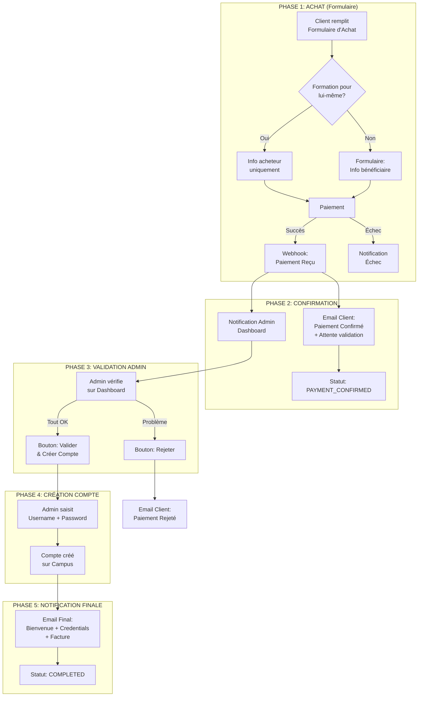

# 🔄 WORKFLOW REVISÉ - INSCRIPTION FORMATIONS LMS

## Version 2.0 - Questions Achat & Campus Externe

---

## 1. VUE D'ENSEMBLE REVISÉE

### Le Workflow Complet



---

## 2. PHASE 1: FORMULAIRE D'ACHAT

### 2.1 Nouveau Formulaire - Champs Requís

Le formulaire d'achat doit maintenant collecter :

```javascript
const purchaseFormSchema = z.object({
  // Informations paiement (existant)
  customerEmail: z.string().email(),
  customerName: z.string(),
  customerSurname: z.string(),
  customerPhone: z.string().optional(),

  // --- NOUVEAU: Question "Pour qui?" ---
  purchaseType: z.enum(["self", "gift"]),

  // Si purchaseType === 'gift', champs bénéficiaire:
  beneficiaryFirstName: z.string().optional(),
  beneficiaryLastName: z.string().optional(),
  beneficiaryEmail: z.string().email().optional(),
  beneficiaryPhone: z.string().optional(),
  beneficiaryRelationship: z.string().optional(),

  // Informations formation
  formationId: z.number(),
  formationPrice: z.number(),
  currency: z.string(),
});
```

### 2.2 Interface Formulaire Suggérée

```
┌─────────────────────────────────────────────────────────┐
│  FORMULAIRE D'ACHAT - FORMATION                        │
├─────────────────────────────────────────────────────────┤
│                                                         │
│  📚 Formation: [Nom de la formation]                    │
│  💰 Prix: 50,000 XAF                                    │
│                                                         │
│  ────────────────────────────────────────────────────  │
│                                                         │
│  ❓ Cette formation est-elle pour vous                  │
│     ou pour une autre personne?                         │
│                                                         │
│     ○ Pour moi                                          │
│     ○ Pour quelqu'un d'autre                            │
│                                                         │
│  ────────────────────────────────────────────────────  │
│                                                         │
│  [✓] J'accepte les conditions générales                │
│                                                         │
│  [  PROCÉDER AU PAIEMENT  ]                            │
└─────────────────────────────────────────────────────────┘
```

**Si "Pour quelqu'un d'autre" → affiche champs supplémentaires :**

```
┌─────────────────────────────────────────────────────────┐
│  INFORMATIONS BÉNÉFICIAIRE                             │
├─────────────────────────────────────────────────────────┤
│                                                         │
│  Nom du bénéficiaire: [_______________]                 │
│  Prénom: [_______________]                             │
│  Email: [_______________]                              │
│  Téléphone: [_______________] (optionnel)               │
│  Relation: [Dropdown: Famille / Ami / Collègue /Autre] │
│                                                         │
└─────────────────────────────────────────────────────────┘
```

---

## 3. PHASE 2: PAIEMENT & CONFIRMATION

### 3.1 Après Paiement Réussi (Webhook)

**Comportement REVISÉ :**

- ❌ **PAS** de facture envoyée maintenant
- ✅ Juste **confirmation de paiement**
- ✅ Message : "Votre paiement a été reçu. Votre inscription sera traitée sous 24h."

```javascript
// NE PLUS envoyer la facture ici!
async function handlePaymentSuccess(webhookData) {
  const order = await Order.findById(webhookData.orderId);

  // 1. Email SIMPLE de confirmation (PAS de facture)
  await MailService.sendPaymentConfirmation({
    to: order.customerEmail,
    orderRef: order.reference,
    amount: order.amount,
    formationName: order.formationName,
    message:
      "Votre paiement a été reçu. Notre équipe va vérifier votre inscription dans les 24h.",
  });

  // 2. Notification Dashboard Admin (HAUTE PRIORITÉ)
  await NotificationService.create({
    type: "PAYMENT_REQUIRES_VALIDATION",
    title: "Paiement à valider",
    orderId: order.id,
    priority: "high",
    formation: order.formationName,
    amount: order.amount,
    customer: order.customerEmail,
    purchaseType: order.purchaseType, // 'self' ou 'gift'
  });

  // 3. Update status
  await order.update({ status: "PAYMENT_CONFIRMED" });

  // 4. Audit
  await AuditLog.log("PAYMENT_CONFIRMED", "order", order.id, {
    amount: order.amount,
    purchaseType: order.purchaseType,
    beneficiary: order.beneficiaryEmail || null,
  });
}
```

### 3.2 Template Email Confirmation (Sans Facture)

```html
<div style="font-family: Arial; max-width: 600px; margin: auto;">
  <h2 style="color: #27ae60;">✅ Paiement Reçu</h2>

  <p>Bonjour <strong>{{customerName}}</strong>,</p>

  <p>
    Nous avons bien reçu votre paiement de <strong>{{amount}}</strong> pour la
    formation <strong>{{formationName}}</strong>.
  </p>

  <div
    style="background: #f4f7f6; padding: 15px; border-left: 4px solid #27ae60; margin: 20px 0;"
  >
    <p style="margin: 0;"><strong>Référence:</strong> {{orderRef}}</p>
    <p style="margin: 0;"><strong>Statut:</strong> En attente de validation</p>
  </div>

  <p>
    Notre équipe va vérifier votre paiement et traiter votre inscription dans
    les <strong>24 à 48 heures</strong>.
  </p>

  <p>
    Vous recevrez un email avec vos accès au campus une fois l'inscription
    finalisée.
  </p>

  <p>Cordialement,<br />L'équipe Studies Learning</p>
</div>
```

---

## 4. PHASE 3: VALIDATION ADMIN

### 4.1 Dashboard Admin - Vue Commandes

```javascript
// API: GET /api/admin/orders?status=PAYMENT_CONFIRMED

// Données affichées:
{
  orders: [
    {
      id: 123,
      reference: "ORD-2026-001",
      customerName: "Jean Dupont",
      customerEmail: "jean@dupont.com",
      formationName: "Formation Python Avancé",
      amount: 50000,
      currency: "XAF",
      purchaseType: "self", // ou "gift"
      beneficiary: null, // si self
      // ou si gift:
      beneficiary: {
        firstName: "Marie",
        lastName: "Dupont",
        email: "marie@dupont.com",
        relationship: "famille",
      },
      paidAt: "2026-02-25T10:30:00Z",
      status: "PAYMENT_CONFIRMED",
    },
  ];
}
```

### 4.2 Actions Admin

| Bouton                     | Condition                   | Action                           |
| -------------------------- | --------------------------- | -------------------------------- |
| **Valider & Créer Compte** | Paiement vérifié OK         | Ouvre formulaire création compte |
| **Rejeter**                | Problème détecté            | Annule et notifie client         |
| **Demander Info**          | Info bénéficiaire manquante | Envoie email de demande          |

### 4.3 Formulaire Création Compte (Admin)

```
┌─────────────────────────────────────────────────────────┐
│  CRÉER ACCÈS CAMPUS - COMMANDE #ORD-2026-001          │
├─────────────────────────────────────────────────────────┤
│                                                         │
│  Client: Jean Dupont (jean@dupont.com)                 │
│  Formation: Formation Python Avancé                    │
│  Montant: 50,000 XAF                                   │
│  Type: Achat pour lui-même                              │
│                                                         │
│  ────────────────────────────────────────────────────  │
│                                                         │
│  IDENTIFIANTS DE CONNEXION                             │
│                                                         │
│  Nom d'utilisateur: [________________]                 │
│  Mot de passe:   [________________] 👁️               │
│                                                         │
│  ────────────────────────────────────────────────────  │
│                                                         │
│  [Annuler]                    [Créer & Envoyer Email]   │
│                                                         │
└─────────────────────────────────────────────────────────┘
```

**SI purchaseType = "gift" (pour quelqu'un d'autre):**

```
┌─────────────────────────────────────────────────────────┐
│  CRÉER ACCÈS CAMPUS - BÉNÉFICIAIRE                    │
├─────────────────────────────────────────────────────────┤
│                                                         │
│  Acheteur: Jean Dupont                                  │
│  Bénéficiaire: Marie Dupont (famille)                  │
│  Email bénéficiaire: marie@dupont.com                  │
│                                                         │
│  ────────────────────────────────────────────────────  │
│                                                         │
│  IDENTIFIANTS:                                          │
│                                                         │
│  Nom d'utilisateur: [________________]                 │
│  Mot de passe:   [________________] 👁️               │
│                                                         │
│  ────────────────────────────────────────────────────  │
│                                                         │
│  [Annuler]                    [Créer & Envoyer Email]  │
│                                                         │
└─────────────────────────────────────────────────────────┘
```

---

## 5. PHASE 4: CRÉATION COMPTE CAMPUS

### 5.1 Note Importante: Campus Externe

Le campus est un système **externe** (hébergé ailleurs). L'admin doit :

1. Se connecter manuellement au campus
2. Créer le compte utilisateur
3. Revenir sur le dashboard PSP pour finaliser

### 5.2 Flux Créer Compte

```javascript
async function createCampusAccount(orderId, adminId, credentials) {
  const order = await Order.findById(orderId);

  // 1. Déterminer l'email du bénéficiaire
  const targetEmail =
    order.purchaseType === "self"
      ? order.customerEmail
      : order.beneficiaryEmail;

  // 2. Envoyer credentials via email (système externe campus)
  // COMME LE CAMPUS EST EXTERNE, on doit envoyer les credentials
  // Le user pourra changer son password après première connexion

  await MailService.sendCredentialsAndInvoice({
    to: targetEmail,
    username: credentials.username,
    password: credentials.password, // Plain text car campus externe
    formationName: order.formationName,
    orderReference: order.reference,
    invoice: true, // ← LA FACTURE EST ENVOYÉE ICI!
    loginUrl: "https://campus.studieslearning.com/login",
  });

  // 3. Update order
  await order.update({
    status: "COMPLETED",
    completedAt: new Date(),
    completedBy: adminId,
    campusUsername: credentials.username,
    credentialsSentAt: new Date(),
  });

  // 4. Audit
  await AuditLog.log("ORDER_COMPLETED", "order", orderId, {
    adminId,
    username: credentials.username,
    beneficiaryEmail: targetEmail,
    invoiceSent: true,
  });
}
```

---

## 6. PHASE 5: EMAIL FINAL (AVEC FACTURE)

### 6.1 Template Email Bienvenue + Credentials + Facture

```html
<div style="font-family: Arial; max-width: 600px; margin: auto;">
  <h2 style="color: #2c3e50;">🎉 Bienvenue sur Studies Learning!</h2>

  <p>Bonjour <strong>{{recipientName}}</strong>,</p>

  <p>
    Votre inscription à la formation <strong>{{formationName}}</strong> a été
    validée!
  </p>

  <!-- 🎯 CREDENTIALS -->
  <div
    style="background: #e8f5e9; padding: 20px; border-radius: 8px; margin: 20px 0;"
  >
    <h3 style="margin-top: 0; color: #27ae60;">Vos accès au campus</h3>
    <p><strong>Nom d'utilisateur:</strong> {{username}}</p>
    <p><strong>Mot de passe:</strong> {{password}}</p>
    <p>
      <a
        href="{{loginUrl}}"
        style="background: #3498db; color: white; padding: 10px 20px; text-decoration: none; border-radius: 5px;"
        >Se connecter au campus</a
      >
    </p>
    <p style="font-size: 12px; color: #666;">
      ⚠️ Changez votre mot de passe après la première connexion
    </p>
  </div>

  <!-- 📄 FACTURE -->
  <div
    style="background: #fff3cd; padding: 20px; border-radius: 8px; margin: 20px 0;"
  >
    <h3 style="margin-top: 0;">📄 Facture</h3>
    <p><strong>Référence:</strong> {{invoiceRef}}</p>
    <p><strong>Date:</strong> {{invoiceDate}}</p>
    <p><strong>Montant:</strong> {{amount}} {{currency}}</p>
  </div>

  <p>Votre facture est disponible en pièce jointe.</p>

  <hr style="border: none; border-top: 1px solid #eee; margin: 20px 0;" />

  <p style="font-size: 12px; color: #999;">
    Questions? Contact: support@studieslearning.com
  </p>
</div>
```

---

## 7. ÉTATS DE COMMANDE (MACHINE À ÉTATS)

```javascript
const OrderStatus = {
  // Phase paiement
  PENDING: "pending", // En attente paiement
  PAYMENT_PROCESSING: "processing", // Paiement en cours
  PAYMENT_FAILED: "failed", // Paiement échoué

  // Phase validation
  PAYMENT_CONFIRMED: "confirmed", // Paiement reçu, en attente validation
  VALIDATED: "validated", // Admin a validé

  // Phase finalisation
  COMPLETED: "completed", // Terminé - accès envoyés

  // États négatifs
  REJECTED: "rejected", // Rejeté par admin
  CANCELLED: "cancelled", // Annulé
  EXPIRED: "expired", // Timeout (si pas de validation)
};
```

### Transitions

```
PENDING → PAYMENT_PROCESSING → PAYMENT_FAILED
              ↓ (success)
        PAYMENT_CONFIRMED → VALIDATED → COMPLETED
              ↓                   ↓
         REJECTED            CANCELLED
              ↓
         EXPIRED (si timeout 7 jours)
```

---

## 8. MODÈLE DE DONNÉES

```javascript
// Modèle Order étendu
Order.init({
  reference: DataTypes.STRING,
  customerEmail: DataTypes.STRING,
  customerName: DataTypes.STRING,
  customerSurname: DataTypes.STRING,
  customerPhone: DataTypes.STRING,

  // NOUVEAU: Type d'achat
  purchaseType: DataTypes.ENUM(["self", "gift"]),

  // NOUVEAU: Info bénéficiaire (si gift)
  beneficiaryFirstName: DataTypes.STRING,
  beneficiaryLastName: DataTypes.STRING,
  beneficiaryEmail: DataTypes.STRING,
  beneficiaryPhone: DataTypes.STRING,
  beneficiaryRelationship: DataTypes.STRING,

  // Formation
  formationId: DataTypes.BIGINT.UNSIGNED,
  formationName: DataTypes.STRING,
  amount: DataTypes.DECIMAL(10, 2),
  currency: DataTypes.STRING,

  // Statut
  status: DataTypes.ENUM(Object.values(OrderStatus)),

  // Timestamps
  paidAt: DataTypes.DATE,
  validatedAt: DataTypes.DATE,
  validatedBy: DataTypes.BIGINT.UNSIGNED,
  completedAt: DataTypes.DATE,
  completedBy: DataTypes.BIGINT.UNSIGNED,

  // Credentials
  campusUsername: DataTypes.STRING,
  credentialsSentAt: DataTypes.DATE,

  // Notes
  adminNotes: DataTypes.TEXT,
  rejectionReason: DataTypes.TEXT,
});
```

---

## 9. RÉSUMÉ DIFFÉRENCES V1 vs V2

| Aspect               | V1 (Mon análisis)         | V2 (Votre vision)                       |
| -------------------- | ------------------------- | --------------------------------------- |
| Question "pour qui?" | Après paiement, par email | **Pendant l'achat, dans le formulaire** |
| Facture              | Après paiement            | **Après validation admin**              |
| Credentials          | Lien reset (API campus)   | **Envoi direct** (campus externe)       |
| Campus               | Intégré via API           | **Système externe**                     |

---

## 10. PROCHAINES ÉTAPES

1. ✅ Valider ce workflow
2. Conception API: `POST /api/orders/initialize` avec nouveau schéma
3. Mise à jour `purchaseFormSchema`
4. Modifier [`payment.controller.js`](apps/backend/controllers/payment.controller.js) pour supporter nouveau flux
5. Créer page admin validation commandes

---

_Workflow V2 - 25 février 2026_  
_Architect: Consultant Solution_
