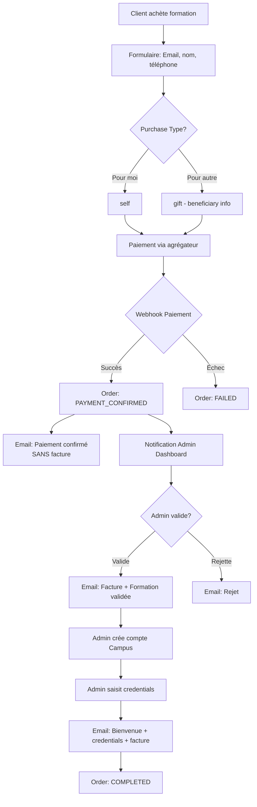
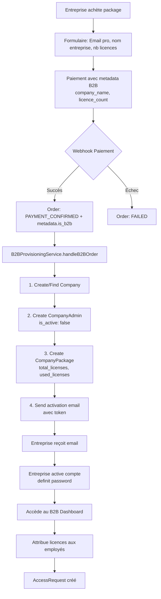
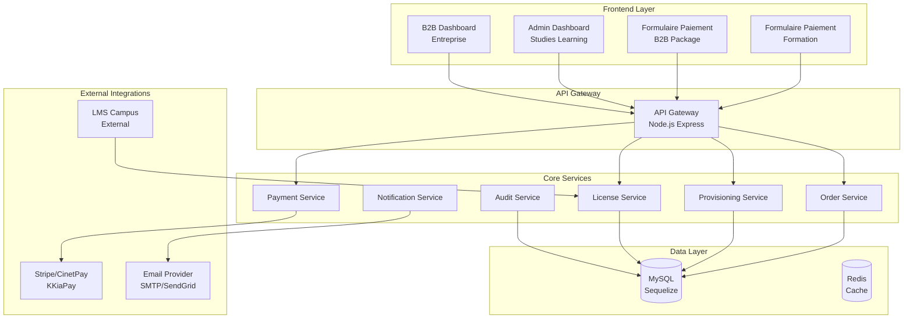

# 📊 RAPPORT D'ANALYSE DE L'ÉCOSYSTÈME DE PAIEMENT

## Projet : Agrégateur de Paiement - Plateforme de Formation SAAS

---

## 1. Vue d'Ensemble de l'Écosystème

### 1.1 Architecture Actuelle

L'écosystème est composé de **4 composants principaux** :

| Composant | Technologie | Responsibility |
|-----------|-------------|----------------|
| **Backend API** | Node.js + Express + Sequelize | Orchestration paiements, gestion orders, provisioning B2B |
| **Admin Dashboard** | Next.js 14 + TypeScript | Gestion commandes, validation, analytics |
| **B2B Dashboard** | Next.js 14 + TypeScript | Gestion packages, licences, équipes |
| **Formulaire Paiement** | Frontend externe | Initialisation paiements, vérification email |

---

## 2. Analyse des Workflows Existants

### 2.1 Workflow Formations (Achats Individuels) ✅



**Statuts du workflow formations :**

- `pending` → `processing` → `payment_confirmed` → `validated` → `completed`
- États d'erreur : `failed`, `rejected`, `expired`

---

### 2.2 Workflow Packages B2B (État Actuel) ⚠️



---

## 3. Modèles de Données Actuels

### 3.1 Modèles Principaux

| Modèle | Table | Description |
|--------|-------|-------------|
| `Order` | `aggp_orders` | Commandes formations et packages |
| `Company` | `sl_companies` | Entreprises clientes B2B |
| `CompanyAdmin` | `sl_company_admins` | Admins des entreprises |
| `CompanyPackage` | `sl_company_packages` | Packages achetés par entreprises |
| `Employee` | `sl_employees` | Employés des entreprises |
| `FormationPackage` | `sl_formation_packages` | Packages de formations disponibles |
| `AccessRequest` | `sl_access_requests` | Demandes d'accès aux formations |

### 3.2 Champs B2B dans Order

```javascript
// Order.metadata pour B2B
{
  is_b2b: true,
  b2b_purchase: true,
  company_name: "Entreprise XYZ",
  company_industry: "Technology",
  company_admin_email: "admin@entreprise.com",
  total_licenses: 10,
  licence_count: 10,
  source: "payment_form_v3"
}
```

---

## 4. Identification des Frictions et Manquements

### 🔴 Frictions Critiques

| # | Problème | Impact | Localisation |
|---|----------|--------|--------------|
| **F1** | Pas de workflow de validation admin pour les B2B | Risque de provisionnement sans vérification | `webhook-processor.service.js` |
| **F2** | CompanyAdmin créé avec password placeholder "AWAITING_ACTIVATION" | Sécurité compromise si activation échoue | `b2b-provisioning.service.js:45` |
| **F3** | Token d'activation stocké dans metadata (pas de champ dédié) | Difficile à auditer, risque de perte | `b2b-provisioning.service.js:54-59` |
| **F4** | Pas de gestion des expirations de packages | Accès illimités après expiration | `company-package.model.js` |
| **F5** | Pas de système de renewal/upgrade | Pas de revenus récurrents | Modèle absent |

### 🟡 Frictions Moyennes

| # | Problème | Impact | Localisation |
|---|----------|--------|--------------|
| **F6** | Pas de distinction purchaseType pour B2B | Confusion avec purchases "self/gift" | `order.model.js` |
| **F7** | CompanyAdmin pas lié à un admin principal | Multiples admins par entreprise non gérés | Modèle incomplet |
| **F8** | Pas de facturation entreprise | Pas de TVA, pas de mentions légales | `mail.service.js` |
| **F9** | Pas de catalogue packages dans le frontend | Achat uniquement via formulaire | Pas de page catalogue B2B |
| **F10** | Dashboard B2B pas complet | Manque: settings, facturation, renewal | Pages incomplètes |

### 🟢 Frictions mineures / Améliorations

| # | Problème | Impact |
|---|----------|--------|
| **F11** | Pas de logs d'audit pour actions B2B | Traçabilité insuffisante |
| **F12** | Pas de notifications temps réel | Latence dans les mises à jour |
| **F13** | Pas de support multi-entreprises | Une seule entreprise par account |

---

## 5. Recommandations Architecturales

### 5.1 Architecture Cible SAAS Premium



### 5.2 Services à Créer

| Service | Responsabilité | Priorité |
|---------|----------------|----------|
| `LicenseManagerService` | Gestion du cycle de vie des licences | P0 |
| `B2BOrderWorkflowService` | Workflow complet B2B (validation → provisioning) | P0 |
| `CompanyBillingService` | Facturation, TVA, abonnements | P1 |
| `RenewalService` | Gestion des renouvellements | P1 |
| `AuditLogService` | Centralisation des logs | P2 |
| `WebSocketService` | Notifications temps réel | P2 |

---

## 6. Plan d'Action SAAS Premium

### Phase 1: Fondations (Semaine 1-2)

| Tâche | Description | Fichiers |
|-------|-------------|-----------|
| 1.1 | Créer modèle CompanySubscription | `models/company-subscription.model.js` |
| 1.2 | Ajouter champs expiry_date obligatoire | `company-package.model.js` |
| 1.3 | Créer table audit_logs B2B | Migration + model |
| 1.4 | Migrer activation_token vers champ dédié | `company-admin.model.js` |

### Phase 2: Workflow B2B Complet (Semaine 3-4)

| Tâche | Description | Fichiers |
|-------|-------------|-----------|
| 2.1 | Créer B2BOrderWorkflowService | `services/b2b-order-workflow.service.js` |
| 2.2 | Ajouter validation admin avant provisioning | `webhook-processor.service.js` |
| 2.3 | Créer endpoint validation B2B orders | `controllers/b2b-order.controller.js` |
| 2.4 | Mettre à jour Admin Dashboard orders | `orders/page.tsx` |

### Phase 3: Gestion Licences (Semaine 5-6)

| Tâche | Description | Fichiers |
|-------|-------------|-----------|
| 3.1 | Créer LicenseManagerService | `services/license-manager.service.js` |
| 3.2 | Implémenter cron expiration | `scripts/cron-license-expiration.js` |
| 3.3 | Ajouter logique upgrade/renewal | `services/renewal.service.js` |
| 3.4 | Dashboard B2B: historique licences | `packages/page.tsx` |

### Phase 4: Facturation B2B (Semaine 7-8)

| Tâche | Description | Fichiers |
|-------|-------------|-----------|
| 4.1 | Créer CompanyBillingService | `services/billing.service.js` |
| 4.2 | Générer factures PDF | `services/invoice-generator.service.js` |
| 4.3 | Intégrer mentions légales | `mail.service.js` |
| 4.4 | Dashboard B2B: Settings & Factures | `settings/page.tsx` |

### Phase 5: Notifications & UX (Semaine 9-10)

| Tâche | Description | Fichiers |
|-------|-------------|-----------|
| 5.1 | Implémenter WebSocket | `services/websocket.service.js` |
| 5.2 | Notifications temps réel | Dashboard components |
| 5.3 | Améliorer UI B2B Dashboard | Pages React |
| 5.4 | Tests E2E | `tests/e2e/*.test.js` |

---

## 7. Matrice de Décision Technique

### 7.1 Authentification B2B

| Option | Avantages | Inconvénients | Recommandation |
|--------|-----------|---------------|----------------|
| JWT simple | Simple, rapide | Rotation difficile | ❌ |
| JWT + Refresh | Sécurisé, moderne | Complexe | ✅ |
| Session HTTPOnly | Sécurisé, contrôlable | Statefull | ✅ pour initial |
| OAuth2/SSO | Enterprise ready | Overkill pour start | Futur |

### 7.2 Gestion des Licences

| Modèle | Use Case | Recommandation |
|--------|----------|----------------|
| Per-seat | 1 utilisateur = 1 licence | ✅ Standard |
| Concurrent | Utilisation simultanée max | Pour grand enterprise |
| Floating | Pool de licences partagées | Pour usage intensif |

### 7.3 Paiements Récurrents

| Provider | Support | Frais | Recommandation |
|----------|---------|-------|----------------|
| Stripe Billing | ✅ Excellent | 0.5% | ✅ Primary |
| CinetPay | ⚠️ Partiel | Variable | Secondary |
| Manual Invoice | ✅ Custom | 0 | Pour gros comptes |

---

## 8. Prochaines Étapes Immédiates

1. **Valider ce plan** avec les stakeholders
2. **Prioriser les tâches** selon le budget
3. **Créer les spécifications détaillées** pour chaque service
4. **Mettre en place l'environnement de développement**

---

_Rapport d'analyse réalisé le 17 mars 2026_  
_Par: Architecte Solution Senior_  
_Projet: AgregateurDePaiement / Studies Learning SAAS_
