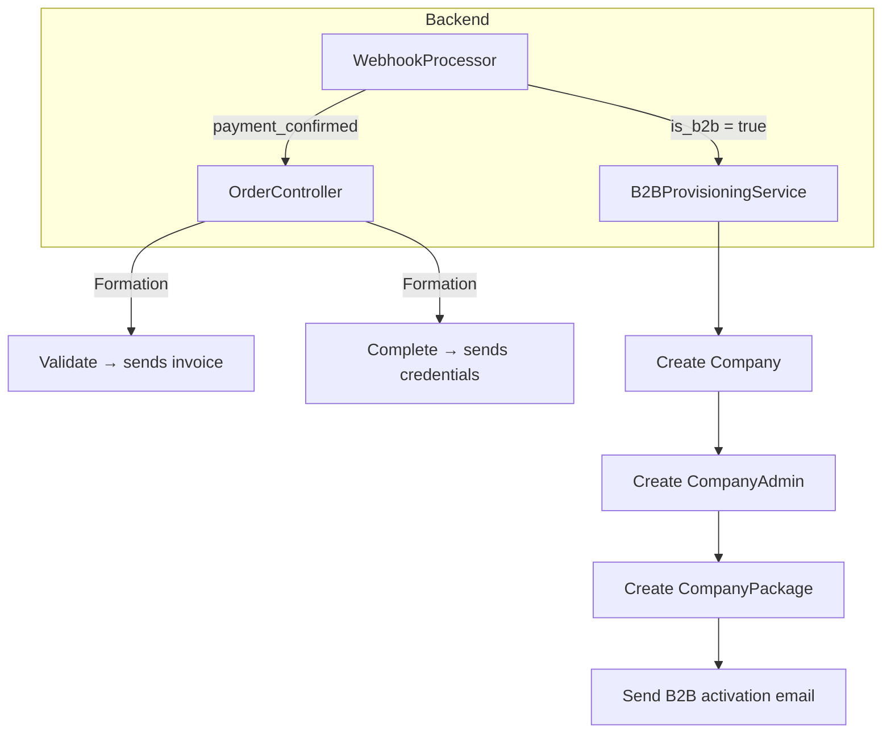

# 🔍 Analyse des Incohérences & Workflow Unifié

## 1. Incohérences de Mapping Identifiées

### 1.1 Incohérences des Noms de Champs

| Emplacement | Problème | Solution |
|-------------|----------|----------|
| [`apps/dashboard/src/app/(dashboard)/orders/page.tsx`](apps/dashboard/src/app/(dashboard)/orders/page.tsx:305) | Utilise `order.customerEmail` mais le backend renvoie `customer_email` | Fallback `(order as any).customer_email` - NON RECOMMANDÉ |
| [`apps/dashboard/src/app/(dashboard)/orders/page.tsx`](apps/dashboard/src/app/(dashboard)/orders/page.tsx:320) | `order.createdAt` vs `order.created_at` | Incohérent - nécessite normalisation |
| [`apps/dashboard/src/app/(dashboard)/orders/[id]/page.tsx`](apps/dashboard/src/app/(dashboard)/orders/[id]/page.tsx:343) | `order.purchaseType` vs `order.purchase_type` | Double format utilisé |

### 1.2 Incohérences UI/UX

| # | Problème | Localisation |
|---|----------|--------------|
| **I1** | Filtre "Types d'achat" manque l'option B2B | [`orders/page.tsx:266`](apps/dashboard/src/app/(dashboard)/orders/page.tsx:266) |
| **I2** | Badge "Package B2B" pas assez visible | [`LmsItemTypeBadge`](apps/dashboard/src/app/(dashboard)/orders/page.tsx:93) |
| **I3** | Stats "En Confirmation" et "A Finaliser" melangent formations et B2B | [`orders/page.tsx:217-218`](apps/dashboard/src/app/(dashboard)/orders/page.tsx:217) |
| **I4** | Les actions "Valider" et "Finaliser" sont identiques pour les 2 types | [`orders/page.tsx:329-346`](apps/dashboard/src/app/(dashboard)/orders/page.tsx:329) |

---

## 2. Différences entre Formation et Package B2B

### 2.1 Tableau Comparatif

| Aspect | Formation (Individuel) | Package B2B |
|--------|------------------------|-------------|
| **Acheteur** | Particulier | Entreprise |
| **Bénéficiaire** | Same person ou gift | Équipe entière |
| **Quantité** | 1 | N licences (licence_count) |
| **Prix** | Prix fixe | Prix × licences |
| **Provisioning** | **MANUEL** (admin crée compte) | **AUTOMATIQUE** (B2BProvisioningService) |
| **Credentials** | Campus E-learning | B2B Dashboard |
| **Validation Admin** | ✅ Requise | ✅ Requise |
| **Facture** | Par formation | Par entreprise |

### 2.2 Workflow Technique Actuel



---

## 3. Workflow Unifié Proposé

### 3.1 Architecture du Workflow

Le cycle de vie est bien **unifié** (same states), mais les **actions** diffèrent :

```mermaid
stateDiagram-v2
    [*] --> PENDING: Commande créée
    PENDING --> PROCESSING: Paiement iniciado
    PROCESSING --> PAYMENT_CONFIRMED: Webhook Success
    PROCESSING --> FAILED: Webhook Failure
    
    PAYMENT_CONFIRMED --> VALIDATED: Admin Validate
    VALIDATED --> COMPLETED: Admin Complete
    
    note right of PAYMENT_CONFIRMED
        Type = Formation → Action: Validate + Invoice
        Type = B2B → Action: Validate + Auto-Provisioning
    end
    
    note right of VALIDATED
        Type = Formation → Action: Credentials Campus
        Type = B2B → Action: (Already provisioned)
    end
```

### 3.2 Matrice des Actions par Type

| Statut | Action | Formation | Package B2B |
|--------|--------|-----------|-------------|
| `payment_confirmed` | **Valider** | Envoie facture | Provisioning automatique + Email activation |
| `validated` | **Finaliser** | Envoie credentials Campus | **Pas d'action** (déjà fait) |
| `payment_confirmed` | **Rejeter** | Notify client | Notify client + Cancel provisioning |

### 3.3 Nouveau Modèle de Données

```javascript
// Extension du modèle Order pour mieux distinguer les types
{
  id: 1,
  reference: "ORD-2026-001",
  
  // Type d'achat - NOUVEAU: ajouter "b2b"
  purchaseType: "self" | "gift" | "b2b",
  
  // Type d'item LMS
  lmsItemType: "course" | "package",
  
  // Métadonnées B2B
  metadata: {
    is_b2b: true,
    company_name: "Entreprise XYZ",
    company_industry: "Technology",
    company_admin_email: "admin@entreprise.com",
    total_licenses: 10,
    
    // Statut du provisioning
    provisioning_status: "pending" | "completed" | "failed",
    company_id: 1,  // Lien vers Company
  }
}
```

---

## 4. Modifications Requises

### 4.1 Backend - Nouveaux Endpoints

```javascript
// POST /api/admin/orders/:id/validate-b2b
{
  // Pour B2B: ne fait que valider + trigger provisioning
  action: "validate_b2b"
}

// POST /api/admin/orders/:id/validate-formation
{
  // Pour Formation: valide + envoie facture
  action: "validate_formation"
}

// GET /api/admin/orders/:id/provisioning-status
{
  // Retourne le statut du provisioning B2B
  provisioning: {
    companyId: 1,
    companyName: "Entreprise XYZ",
    status: "completed",
    activatedAt: "2026-03-17..."
  }
}
```

### 4.2 Dashboard - Améliorations UI

1. **Nouveau filtre "Type"**

   ```tsx
   <select>
     <option value="">Tous les types</option>
     <option value="self">Formation - Personnel</option>
     <option value="gift">Formation - Cadeau</option>
     <option value="b2b">Package B2B</option>
   </select>
   ```

2. **Badge B2B plus visible**

   ```tsx
   function PurchaseTypeBadge({ type, lmsItemType }) {
     if (lmsItemType === 'package' || type === 'b2b') {
       return <span className="bg-primary text-white">🏢 B2B</span>;
     }
     // ...
   }
   ```

3. **Actions contextuelles**

   ```tsx
   {order.status === 'payment_confirmed' && (
     <>
       {order.lmsItemType === 'package' ? (
         <Button onClick={handleValidateB2B}>Valider & Provisionner</Button>
       ) : (
         <Button onClick={handleValidateFormation}>Valider & Facturer</Button>
       )}
     </>
   )}
   
   {order.status === 'validated' && order.lmsItemType !== 'package' && (
     <Button onClick={handleComplete}>Envoyer Credentials</Button>
   )}
   ```

4. **Stats séparées**

   ```tsx
   // Stats formations
   orders.filter(o => o.status === 'payment_confirmed' && o.lmsItemType !== 'package')
   
   // Stats B2B
   orders.filter(o => o.status === 'payment_confirmed' && o.lmsItemType === 'package')
   ```

---

## 5. Corrections de Mapping Recommandées

### 5.1 Normaliser les Types TypeScript

Créer un fichier de types partagés :

```typescript
// lib/types/orders.ts
export interface OrderResponse {
  id: number;
  reference: string;
  
  // Always use snake_case from API
  customer_email: string;
  customer_name: string;
  customer_surname: string;
  customer_phone: string;
  
  // Computed helpers
  customerEmail: string; // getter
  customerName: string;  // getter
  
  created_at: string;
  createdAt?: string;    // alias
  
  // ...
}
```

### 5.2 Transformer les Réponses API

```typescript
// api/transformers/order.transformer.ts
export function transformOrder(raw: any): Order {
  return {
    ...raw,
    // Ensure camelCase aliases
    customerEmail: raw.customer_email,
    customerName: raw.customer_name,
    customerSurname: raw.customer_surname,
    createdAt: raw.created_at || raw.createdAt,
  };
}
```

---

## 6. Plan d'Implémentation

| Phase | Tâche | Priorité |
|-------|-------|----------|
| **1** | Corriger le mapping dans le frontend (normalisation) | P0 |
| **2** | Ajouter le filtre "B2B" dans la liste | P0 |
| **3** | Différencier les actions par type | P0 |
| **4** | Ajouter endpoint provisioning-status | P1 |
| **5** | Stats séparées formations vs B2B | P1 |
| **6** | Tests E2E du workflow | P2 |

---

_Document d'analyse créé le 17 mars 2026_  
_Par: Architecte Solution_
