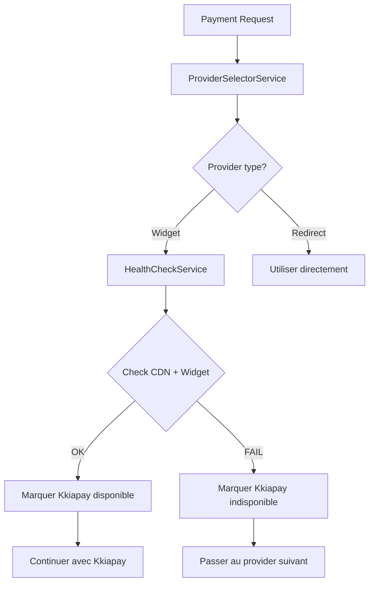

# Plan: Health Check pour Providers de Paiement (Widget-Uniquement)

## 1. Analyse des URLs à Vérifier

### Critère: Providers Widget-Based Uniquement

Le health check ne concerne que les providers qui utilisent un **widget frontend** (iframe/modal). Les providers redirect (CinetPay, Stripe) n'ont pas besoin de health check car:

- Le paiement se fait sur leur serveur
- Si leur API est down, la redirection échouera de toute façon

### Providers Concernés

| Provider    | Type     | Health Check Requis? |
| ----------- | -------- | -------------------- |
| **Kkiapay** | Widget   | ✅ OUI               |
| CinetPay    | Redirect | ❌ NON               |
| Stripe      | Redirect | ❌ NON               |

### URLs Kkiapay à Vérifier

| URL                            | Type           | Objectif                          |
| ------------------------------ | -------------- | --------------------------------- |
| `https://cdn.kkiapay.me/k.js`  | CDN JavaScript | Charge le SDK client              |
| `https://widget-v3.kkiapay.me` | Widget Iframe  | Affiche le formulaire de paiement |

---

## 2. Conception du Service de Health Check

### 2.1 Architecture



### 2.2 Interface du Service

```typescript
interface HealthCheckResult {
  provider: string;
  available: boolean;
  checkedAt: Date;
  latency: number;
  error?: string;
}

interface ProviderHealthService {
  // Vérifier si un provider nécessite un health check
  needsHealthCheck(providerCode: string): boolean;

  // Vérifier la disponibilité d'un provider
  async checkProvider(providerCode: string): Promise<HealthCheckResult>;

  // Est-ce que le provider est disponible? (avec cache)
  isAvailable(providerCode: string): boolean;
}
```

---

## 3. Stratégie de Cache

### 3.1 Problème

- Faire un HTTP request à chaque paiement est trop lent
- Les providers peuvent être temporairement indisponibles

### 3.2 Solution: Cache avec TTL

```javascript
// Configuration du cache - 5 minutes par défaut
const CACHE_TTL = {
  kkiapay: 5 * 60 * 1000, // 5 minutes
};
```

### 3.3 Stratégie de vérification

| Condition             | Action                  |
| --------------------- | ----------------------- |
| Cache expiré (>5 min) | Refaire le health check |
| Cache valide          | Utiliser le cache       |
| Première utilisation  | Faire le health check   |

---

## 4. Implémentation Proposée

### 4.1 Service: `provider-health.service.js`

```javascript
import fetch from "node-fetch";

const WIDGET_PROVIDERS = ["kkiapay"]; // Liste des providers widget

const HEALTH_CHECK_CONFIG = {
  kkiapay: {
    endpoints: [
      { url: "https://cdn.kkiapay.me/k.js", method: "HEAD" },
      { url: "https://widget-v3.kkiapay.me", method: "HEAD" },
    ],
    timeout: 5000,
    cacheTTL: 5 * 60 * 1000,
  },
};

class ProviderHealthService {
  constructor() {
    this.cache = new Map();
  }

  /**
   * Vérifie si un provider nécessite un health check
   * Only widget-based providers need health checks
   */
  needsHealthCheck(providerCode) {
    return WIDGET_PROVIDERS.includes(providerCode);
  }

  async checkProviderHealth(providerCode) {
    // Si pas un provider widget, considéré comme disponible
    if (!this.needsHealthCheck(providerCode)) {
      return {
        available: true,
        reason: "Redirect provider, no health check needed",
      };
    }

    const config = HEALTH_CHECK_CONFIG[providerCode];
    if (!config) {
      return { available: true, reason: "No health check configured" };
    }

    // Vérifier le cache
    const cached = this.cache.get(providerCode);
    if (cached && Date.now() - cached.timestamp < config.cacheTTL) {
      return cached.result;
    }

    // Faire le health check HTTP
    const results = await Promise.allSettled(
      config.endpoints.map(async (endpoint) => {
        const controller = new AbortController();
        const timeout = setTimeout(() => controller.abort(), config.timeout);

        try {
          const response = await fetch(endpoint.url, {
            method: endpoint.method,
            signal: controller.signal,
          });
          return response.ok;
        } catch (error) {
          return false;
        } finally {
          clearTimeout(timeout);
        }
      }),
    );

    const available = results.every((r) => r.status === "fulfilled" && r.value);

    // Mettre en cache
    this.cache.set(providerCode, {
      result: { available, checkedAt: new Date() },
      timestamp: Date.now(),
    });

    return { available, checkedAt: new Date() };
  }
}

export default new ProviderHealthService();
```

### 4.2 Intégration dans ProviderSelectorService

```javascript
import providerHealthService from "./provider-health.service.js";

class ProviderSelectorService {
  constructor(paymentIntent) {
    this.paymentIntent = paymentIntent;
  }

  async initialize(paymentMethod, countryCode) {
    // 1. Récupérer les routes disponibles
    const rawRoutes = await ProviderRouterService.findAvailableRoutes(
      countryCode,
      this.paymentIntent.currency,
      this.paymentIntent.amount,
    );

    // 2. Filtrer par méthode de paiement
    let routes = ProviderRouterService.filterByPaymentMethod(
      rawRoutes,
      paymentMethod,
    );

    // 3. Vérifier la santé des providers widget uniquement
    const healthyRoutes = [];
    for (const route of routes) {
      // Skip health check pour providers redirect (CinetPay, Stripe)
      if (!providerHealthService.needsHealthCheck(route.provider.code)) {
        healthyRoutes.push(route);
        continue;
      }

      // Health check pour providers widget (Kkiapay)
      const health = await providerHealthService.checkProviderHealth(
        route.provider.code,
      );

      if (health.available) {
        healthyRoutes.push(route);
        console.log(`[ProviderSelector] ${route.provider.name} is AVAILABLE`);
      } else {
        console.warn(
          `[ProviderSelector] ${route.provider.name} is UNAVAILABLE (${health.reason}), skipping`,
        );
      }
    }

    this.routes = healthyRoutes;
    return this.routes;
  }
}
```

---

## 5. Flux de Paiement avec Health Check

```mermaid
sequenceDiagram
    participant Frontend
    participant Backend
    participant HealthService
    participant KkiapayAPI

    Frontend->>+Backend: POST /api/payments/init
    Backend->>+HealthService: checkProviderHealth("kkiapay")

    alt Provider est redirect (CinetPay/Stripe)
        HealthService-->>Backend: { available: true, reason: "redirect" }
        Backend->>Backend: Utiliser le provider directement
    else Provider est widget (Kkiapay)
        HealthService->>+KkiapayAPI: HEAD https://cdn.kkiapay.me/k.js
        KkiapayAPI-->>-HealthService: 200 OK
        HealthService->>+KkiapayAPI: HEAD https://widget-v3.kkiapay.me
        KkiapayAPI-->>-HealthService: 200 OK
        HealthService-->>Backend: { available: true }
    end

    alt Kkiapay disponible
        Backend->>Backend: Utiliser Kkiapay
        Backend-->>-Frontend: { widgetParams }
    else Kkiapay indisponible
        Backend->>Backend: Passer à CinetPay
        Backend-->>-Frontend: { redirectUrl: CinetPay }
    end
```

---

## 6. Résumé

| Aspect                  | Détail                                |
| ----------------------- | ------------------------------------- |
| **Providers concernés** | Kkiapay uniquement (widget)           |
| **Providers ignorés**   | CinetPay, Stripe (redirect)           |
| **URLs vérifiées**      | cdn.kkiapay.me + widget-v3.kkiapay.me |
| **Cache TTL**           | 5 minutes                             |
| **Timeout**             | 5 secondes                            |
| **Fallback**            | Automatique si unavailable            |

---

## 7. Prochaines Étapes

1. Créer le fichier `provider-health.service.js`
2. Intégrer dans `ProviderSelectorService`
3. Tester avec simulation d'indisponibilité
4. Dashboard monitoring (optionnel)
