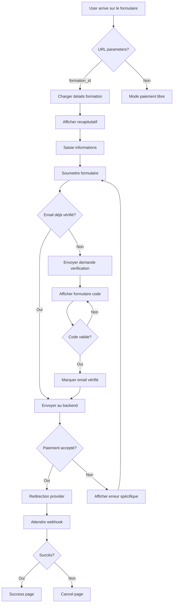
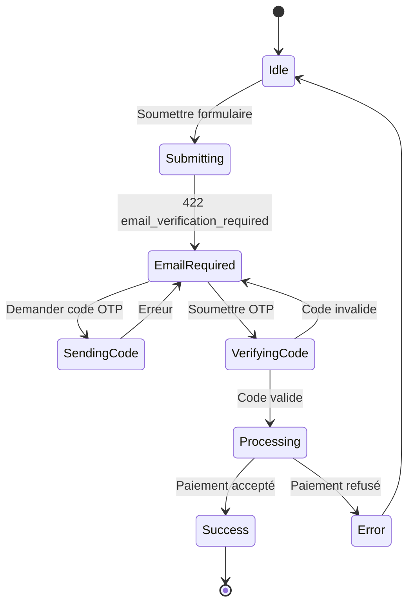

# 📋 PLAN DE REFONTE MAJEURE - Formulaire de Paiement

## Version 3.0 - Intelligent, Complet, Robuste

---

## 1. ANALYSE DES PROBLÈMES ACTUELS

### 1.1 Problèmes Identifiés

| #   | Problème                                | Impact                   | Sévérité |
| --- | --------------------------------------- | ------------------------ | -------- |
| 1   | Incompatibilité champs frontend/backend | Paiement échoue toujours | CRITIQUE |
| 2   | Clé API non valide                      | Aucune requête ne passe  | CRITIQUE |
| 3   | Flux email verification absent          | Blocage total            | CRITIQUE |
| 4   | URLs de retour invalides                | Validation échoue        | CRITIQUE |
| 5   | Code JavaScript dupliqué                | Maintenance impossible   | HAUTE    |
| 6   | CSS désorganisé                         | Incohérence visuelle     | MOYENNE  |
| 7   | Pas de logs/debug                       | Impossible à debuguer    | HAUTE    |

---

## 2. ARCHITECTURE CIBLE

### 2.1 Vue d'Ensemble

```
┌─────────────────────────────────────────────────────────────────────────┐
│                     FORMULAIRE DE PAIEMENT v3.0                         │
├─────────────────────────────────────────────────────────────────────────┤
│                                                                          │
│  ┌──────────────────┐    ┌──────────────────┐    ┌────────────────┐  │
│  │   UI LAYER       │    │  SERVICE LAYER   │    │  API LAYER     │  │
│  │  (Vanilla JS)    │───▶│  (Core Engine)   │───▶│  (HTTP Client) │  │
│  └──────────────────┘    └──────────────────┘    └───────┬────────┘  │
│                                                          │             │
│  ┌──────────────────┐    ┌──────────────────┐           │             │
│  │  STATE MANAGER   │◀───│  EVENT HANDLER   │◀─────────┘             │
│  │  (LocalStorage)  │    │  (User Actions)  │                         │
│  └──────────────────┘    └──────────────────┘                         │
│                                                                          │
└─────────────────────────────────────────────────────────────────────────┘
                                   │
                                   ▼
┌─────────────────────────────────────────────────────────────────────────┐
│                         BACKEND PSP                                     │
│  ┌─────────────┐  ┌─────────────┐  ┌─────────────┐  ┌─────────────┐  │
│  │   Stripe    │  │  CinetPay   │  │  Kkiapay    │  │   LMS       │  │
│  └─────────────┘  └─────────────┘  └─────────────┘  └─────────────┘  │
└─────────────────────────────────────────────────────────────────────────┘
```

### 2.2 Structure des Fichiers Cible

```
apps/formulaire-payement/
├── index.html                    # Page principale (refaite)
├── success.html                  # Page succès
├── cancel.html                   # Page annulation
│
├── css/
│   ├── payment-form.css         # Design System unifié
│   └── components.css           # Composants réutilisables
│
├── js/
│   ├── main.js                  # Point d'entrée
│   ├── app.js                   # Application principale
│   │
│   ├── core/
│   │   ├── state.js             # Gestion d'état
│   │   ├── events.js            # Gestionnaire d'événements
│   │   ├── validator.js         # Validation formulaire
│   │   └── logger.js            # Systeme de logs
│   │
│   ├── services/
│   │   ├── payment.service.js  # Logique de paiement
│   │   ├── email.service.js     # Vérification email
│   │   └── storage.service.js   # LocalStorage
│   │
│   ├── api/
│   │   ├── client.js           # Client HTTP unifié
│   │   ├── endpoints.js         # Configuration URLs
│   │   └── middleware.js        # Intercepteurs
│   │
│   ├── ui/
│   │   ├── form.js              # Gestion formulaire
│   │   ├── country-selector.js  # Selecteur pays
│   │   ├── modal.js             # Modales
│   │   ├── toast.js             # Notifications
│   │   └── loader.js            # Indicateurs chargement
│   │
│   └── utils/
│       ├── format.js            # Formateurs
│       └── helpers.js           # Fonctions utilitaires
│
└── php/
    ├── config.php               # Configuration centralisée
    ├── api-client.php           # Client API
    ├── init-payment.php         # Endpoint paiement
    ├── verify-email.php         # Vérification email
    ├── request-code.php         # Demande code
    └── check-status.php         # Statut paiement
```

---

## 3. FONCTIONNALITÉS INTELLIGENTES

### 3.1 Flux de Paiement Complet



### 3.2 Gestion Intelligente des Erreurs

| Type d'erreur       | Comportement                      | Action UI             |
| ------------------- | --------------------------------- | --------------------- |
| Email non vérifié   | Bloquer + Afficher formulaire OTP | Modal verificación    |
| Montant invalide    | Validation instantanée            | Message sous le champ |
| Provider défaillant | Failover automatique              | Toast notification    |
| Timeout réseau      | Retry automatique (3x)            | Indicateur progres    |
| Session expirée     | Reinitialiser + recommencer       | Alert + redirect      |

### 3.3 Estados del Formulaire

```javascript
const FormState = {
  IDLE: "idle", // Attente de saisie
  VALIDATING: "validating", // Validation en cours
  SUBMITTING: "submitting", // Soumission
  EMAIL_VERIFICATION: "email_verification", // En attente OTP
  REDIRECTING: "redirecting", // Vers provider
  SUCCESS: "success", // Paiement réussi
  ERROR: "error", // Erreur
};
```

---

## 4. INTÉGRATION BACKEND

### 4.1 Configuration API

**Fichier**: `js/api/endpoints.js`

```javascript
const API_CONFIG = {
  baseUrl: window.APP_CONFIG?.backendUrl || "/php",
  timeout: 30000,
  retries: 3,
  endpoints: {
    initPayment: "/init-payment.php",
    verifyEmail: "/verify-email.php",
    requestCode: "/request-code.php",
    checkStatus: "/check-status.php",
  },
  headers: {
    "Content-Type": "application/json",
    Accept: "application/json",
  },
};
```

### 4.2 Mapping des Champs

**CORRECTION CRITIQUE**:

```javascript
// Mapping frontend vers format backend
const fieldMapping = {
  // Customer
  name: (v) => ({
    customerFirstname: v.split(" ")[0] || "",
    customerSurname: v.split(" ").slice(1).join(" ") || "",
  }),
  mail: "customerEmail",
  phone: "customerPhoneNumber", // CHANGÉ!
  city: "customerCity",
  country: "countryCode",

  // Payment
  price: (v, ctx) => ({
    amount: parseFloat(v) * ctx.licenceCount,
  }),
  currency: "currency",
  method: (v) => ({
    paymentMethod: v === "mobile" ? "mobile_money" : v,
  }),

  // Purchase type
  purchase_type: "purchaseType",
  beneficiary_name: "beneficiaryFirstName",
  beneficiary_email: "beneficiaryEmail",
  beneficiary_phone: "beneficiaryPhone",
  beneficiary_relationship: "beneficiaryRelationship",

  // URLs (VALIDES!)
  successUrl: () => `${window.location.origin}/success.html`,
  cancelUrl: () => `${window.location.origin}/cancel.html`,

  // Metadata
  metadata: (v, ctx) => ({
    formation_id: ctx.formationId,
    formation_name: ctx.formationName,
    licence_count: ctx.licenceCount,
    source: "payment_form_v3",
  }),
};
```

### 4.3 Gestion de l'Authentification

```javascript
// Configuration de la clé API
const API_KEY = window.APP_CONFIG?.apiKey || null;

// Auto-discovery de la clé au chargement
async function initializeApiClient() {
  if (!API_KEY) {
    // Essayer de récupérer depuis le backend
    const response = await fetch("/php/get-config.php");
    const config = await response.json();
    window.APP_CONFIG = config;
  }
  return API_KEY;
}
```

---

## 5. COMPOSANTS UI

### 5.1 Formulaire Intelligent

```javascript
class PaymentForm {
  constructor(containerId, config) {
    this.container = document.getElementById(containerId);
    this.state = FormState.IDLE;
    this.data = {};
    this.errors = {};

    this.init();
  }

  init() {
    this.bindEvents();
    this.loadFromURL();
    this.restoreState();
    this.updateDisplay();
  }

  bindEvents() {
    // Type d'achat (self/gift)
    this.on(
      "change",
      '[name="purchase_type"]',
      this.handlePurchaseType.bind(this),
    );

    // Methode de paiement
    this.on(
      "change",
      '[name="payment-method"]',
      this.handleMethodChange.bind(this),
    );

    // Devise
    this.on("change", "#currency-select", this.handleCurrencyChange.bind(this));

    // Licences
    this.on("change", "#licence", this.handleLicenceChange.bind(this));

    // Soumission
    this.on("submit", "#payment-form", this.handleSubmit.bind(this));
  }

  // ... autres méthodes
}
```

### 5.2 Selecteur de Pays avec API Externe

**API Utilisée**: `https://restcountries.com/v3.1/all`
- Retourne tous les pays du monde
- Code ISO 3166-1 alpha-2 (cca2)
- Drapeaux SVG
- Traductions multiples (incl. Français)

**Fallback**: Liste locale des pays Afrique si API indisponible

```javascript
class CountrySelector {
  constructor(triggerId, dropdownId) {
    this.countries = [];
    this.filtered = [];
    this.cache = new Map(); // Cache API

    this.init();
  }

  async loadCountries() {
    // 1. Vérifier cache localStorage
    const cached = this.getFromCache();
    if (cached) return cached;

    // 2. Charger depuis API ou fallback local
    try {
      const response = await fetch(
        "https://restcountries.com/v3.1/all?fields=name,flags,cca2,translations",
      );
      const data = await response.json();

      this.countries = data
        .map((c) => ({
          code: c.cca2,
          name: c.translations.fra?.common || c.name.common,
          flag: c.flags.svg,
        }))
        .sort((a, b) => a.name.localeCompare(b.name));

      this.saveToCache(this.countries);
    } catch (e) {
      this.countries = this.getFallbackList();
    }

    this.render();
  }

  getFallbackList() {
    return [
      { code: "CM", name: "Cameroun", flag: "https://flagcdn.com/w320/cm.png" },
      { code: "SN", name: "Sénégal", flag: "https://flagcdn.com/w320/sn.png" },
      {
        code: "CI",
        name: "Côte d'Ivoire",
        flag: "https://flagcdn.com/w320/ci.png",
      },
      // ... autres pays Afrique
    ];
  }
}
```

### 5.3 Système de Notifications

```javascript
class ToastNotification {
  static show(message, type = "info", duration = 5000) {
    const toast = document.createElement("div");
    toast.className = `toast toast--${type}`;
    toast.innerHTML = `
      <div class="toast__icon">${this.getIcon(type)}</div>
      <div class="toast__message">${message}</div>
      <button class="toast__close">&times;</button>
    `;

    document.body.appendChild(toast);

    // Animation
    setTimeout(() => toast.classList.add("toast--visible"), 10);

    // Auto-hide
    setTimeout(() => this.hide(toast), duration);
  }

  static success(msg) {
    this.show(msg, "success");
  }
  static error(msg) {
    this.show(msg, "error");
  }
  static warning(msg) {
    this.show(msg, "warning");
  }
  static info(msg) {
    this.show(msg, "info");
  }
}
```

---

## 6. FLUX EMAIL VERIFICATION

### 6.1 Diagramme d'État



### 6.2 Implémentation

```javascript
class EmailVerificationFlow {
  constructor(onVerified) {
    this.onVerified = onVerified;
    this.email = null;
    this.maxAttempts = 5;
    this.attempts = 0;
  }

  async requestCode(email) {
    this.email = email;

    const response = await fetch("/php/request-code.php", {
      method: "POST",
      body: JSON.stringify({ email }),
    });

    if (!response.ok) {
      throw new Error("Impossible de envoyer le code");
    }

    this.showVerificationUI();
  }

  async verifyCode(code) {
    this.attempts++;

    if (this.attempts >= this.maxAttempts) {
      throw new Error("Trop de tentatives. Veuillez redemander un code.");
    }

    const response = await fetch("/php/verify-email.php", {
      method: "POST",
      body: JSON.stringify({
        email: this.email,
        code: code,
      }),
    });

    const data = await response.json();

    if (data.status === "success") {
      this.onVerified(this.email);
      return true;
    }

    return false;
  }

  showVerificationUI() {
    // Afficher le modal de vérification
    const modal = document.getElementById("verify-modal");
    modal.classList.add("modal--visible");
  }
}
```

---

## 7. PERSISTANCE D'ÉTAT

### 7.1 Sauvegarde/Restauration

```javascript
class StateManager {
  static STORAGE_KEY = "payment_form_state";

  static save(state) {
    const data = {
      ...state,
      timestamp: Date.now(),
    };

    try {
      localStorage.setItem(this.STORAGE_KEY, JSON.stringify(data));
    } catch (e) {
      console.warn("Impossible de sauvegarder l'état:", e);
    }
  }

  static restore() {
    try {
      const stored = localStorage.getItem(this.STORAGE_KEY);
      if (!stored) return null;

      const data = JSON.parse(stored);

      // Expirer après 30 minutes
      if (Date.now() - data.timestamp > 30 * 60 * 1000) {
        this.clear();
        return null;
      }

      return data;
    } catch (e) {
      return null;
    }
  }

  static clear() {
    localStorage.removeItem(this.STORAGE_KEY);
  }
}
```

---

## 8. PHASES D'IMPLÉMENTATION

### Phase 1: Fondations

- [ ] Nettoyer la structure des fichiers
- [ ] Créer le Design System CSS unifié
- [ ] Implémenter le client API de base
- [ ] Configurer les endpoints

### Phase 2: Composants Core

- [ ] StateManager
- [ ] Logger
- [ ] CountrySelector
- [ ] Toast notifications

### Phase 3: Logique Métier

- [ ] PaymentForm class principale
- [ ] Validation des champs
- [ ] Mapping des données
- [ ] Gestion des erreurs

### Phase 4: Flux Avancés

- [ ] Email verification flow
- [ ] Retry automatique
- [ ] Failover provider

### Phase 5: Tests & Documentation

- [ ] Tests unitaires
- [ ] Tests d'intégration
- [ ] Documentation technique
- [ ] Guide d'utilisation

---

## 9. CHECKLIST TECHNIQUE

### Backend Integration

- [ ] API Key valide configurée
- [ ] Tous les endpoints PHP fonctionnels
- [ ] CORS configuré correctement
- [ ] Rate limiting actif
- [ ] Logs fonctionnels

### Frontend Quality

- [ ] Validation temps réel
- [ ] Feedback visuel immédiat
- [ ] Gestion offline dégraceuse
- [ ] Responsive design complet
- [ ] Accessibilité (ARIA)

### Security

- [ ] Sanitization des entrées
- [ ] HTTPS obligatoire
- [ ] Rate limiting client
- [ ] Timeout sur les requêtes

---

## 10. LIVRABLES

1. **Code source propre** et documenté
2. **Spécification technique** (ce document)
3. **Guide d'intégration** pour les développeurs
4. **Tests automatisés** (Jest/Playwright)
5. **Page de démonstration** fonctionnelle

---

_Document généré le 27 février 2026_
_Version: 3.0.0_
